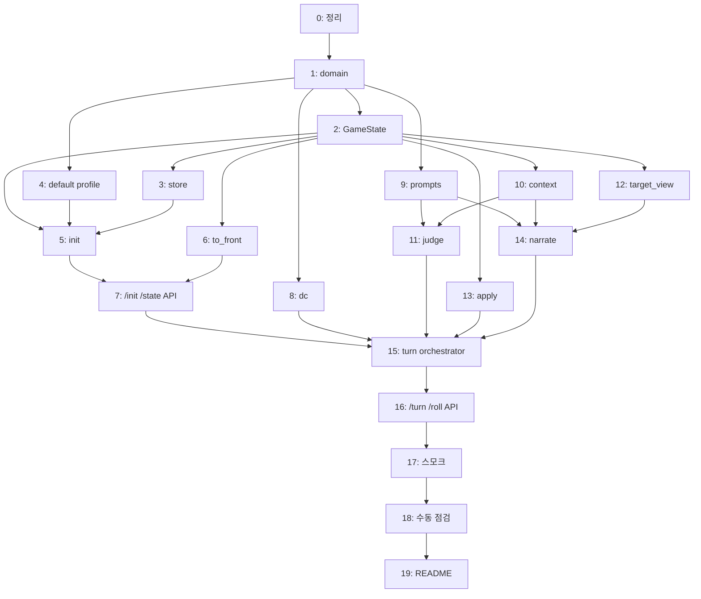

# P1 백엔드 구현 플랜

> **For agentic workers:** REQUIRED SUB-SKILL: Use superpowers:subagent-driven-development (recommended) or superpowers:executing-plans to implement this plan task-by-task. Steps use checkbox (`- [ ]`) syntax for tracking.

**Goal:** 프론트의 자연어 채팅으로 한 턴이 굴러가고 Hero/Subject/Quest/Place/Log 가 갱신되는 백엔드를 완성한다.

**Architecture:** FastAPI + SSE. 턴은 judge LLM → (roll 분기 시 pending → 프론트 주사위 → /roll) → narrate LLM → state 적용. 상태는 게임당 JSON 파일 하나. 레거시 `legacy/docs/plan.md` 구조 계승, 코드는 새로 작성.

**Tech Stack:** Python 3.11+, FastAPI, Pydantic v2, OpenAI SDK (llama.cpp 용), pytest, python-dotenv.

**Spec:** `back/docs/superpowers/specs/2026-04-19-back-p1-design.md` (이 플랜은 스펙의 모든 절을 구현한다)

---

## 읽는 법

- 각 Task는 **Why → Files → Interface → Tests → Steps** 순서.
- **Interface** 블록은 "이 Task가 끝나면 이런 타입·함수 시그니처가 존재해야 한다" 이다. 내부 구현은 구현자 재량.
- **Tests** 는 반드시 작성해야 하는 테스트 이름·검증 포인트. 실제 코드는 구현자가.
- **Steps** 는 TDD 루틴 체크박스: 실패 테스트 → 구현 → 통과 확인 → 커밋.

### 공통 TDD 루틴 (모든 Task 공통)

모든 Task 의 Steps 는 아래 5단계를 한 사이클로 돈다. 반복 설명을 피하기 위해 각 Task 에서는 체크박스만 둔다.

1. **Red** — 실패하는 테스트 작성 (Task 의 Tests 블록 기준)
2. **Run red** — `pytest -xvs <테스트 경로>` 로 실패 확인
3. **Green** — 최소 구현
4. **Run green** — `pytest -xvs <테스트 경로>` 로 통과 확인
5. **Commit** — `git add <파일들> && git commit -m "<scope>: <요약>"`

커밋 메시지 컨벤션: `feat(back)`, `test(back)`, `refactor(back)`, `chore(back)` 접두.

---

## Task 0: 워크트리 확인과 초기 정리

**Why:** 현재 `back/src/` 에 이미 `api/`, `llm_client/` 골격이 있다. 스펙대로면 `llm_client/` → `llm/`, 새 모듈(`pipeline`, `state`, `domain`, `ontology`, `mapping`) 이 추가된다. 이름 통일 먼저.

**Files:**
- Rename: `back/src/llm_client/` → `back/src/llm/`
- Modify: `back/run_api.py` (import 경로)
- Modify: `back/requirements.txt` (pytest, pytest-asyncio 추가)

**Interface:**
- `from src.llm import LLMClient` 가 여전히 동작해야 함
- `pytest` 커맨드가 `back/` 에서 실행 가능해야 함

**Tests:**
- 수동 확인: `cd back && python -c "from src.llm import LLMClient; print(LLMClient)"` 가 임포트 성공
- `cd back && pytest --version` 이 버전 출력

**Steps:**
- [ ] `git mv back/src/llm_client back/src/llm`
- [ ] `back/run_api.py` 의 `from src.llm_client import LLMClient` → `from src.llm import LLMClient`
- [ ] `back/requirements.txt` 에 `pytest`, `pytest-asyncio`, `httpx` 추가
- [ ] `back/tests/` 디렉토리 생성 + 빈 `conftest.py` (향후 fixture 공유용)
- [ ] `back/pytest.ini` 작성: `testpaths = tests`, `asyncio_mode = auto`
- [ ] `pip install -r requirements.txt` 실행
- [ ] 수동 임포트 체크 통과 확인
- [ ] Commit: `chore(back): rename llm_client to llm, add pytest`

---

## Task 1: domain 엔티티 스키마

**Why:** 파이프라인은 내부 도메인 타입 위에서 돈다. 레거시 §8·§9 계승한 타입을 먼저 굳혀야 이후 Task 가 문법적으로 컴파일된다.

**Files:**
- Create: `back/src/domain/__init__.py`
- Create: `back/src/domain/types.py` — enum, Literal
- Create: `back/src/domain/entities.py` — Character, Location, Item, Quest, Connection, Equipment, Stats
- Create: `back/src/domain/memory.py` — Memory, TurnLogEntry, DialoguePair, PendingCheck
- Create: `back/tests/test_domain.py`

**Interface:**

```python
# src/domain/types.py
StatKey = Literal['STR', 'DEX', 'CON', 'INT', 'WIS', 'CHA']
Tier = Literal['easy', 'moderate', 'hard', 'very_hard']
Grade = Literal['critical_success', 'success', 'partial_success', 'failure', 'critical_failure']
Action = Literal['skip', 'roll', 'combat', 'clarify']
Intent = Literal['friendly', 'hostile', 'deceptive', 'neutral']

# src/domain/entities.py
class Stats(BaseModel): STR, DEX, CON, INT, WIS, CHA: int
class Equipment(BaseModel): head, top, bottom, feet, leftHand, rightHand, acc1, acc2: str | None
class Character(BaseModel): id, name, race, clazz, level, hp, hp_max, ... (스펙 §5.1 참조)
class Location(BaseModel): id, name, description, weather: list[str], ...
class Quest(BaseModel): id, title, giver_id, difficulty, conditions, ...
class Item(BaseModel): id, name, qty_default, tags, ...
```

**Tests:**
- `test_character_requires_core_fields` — 필드 누락 시 ValidationError
- `test_stats_all_six` — Stats 가 6개 스탯 모두 요구
- `test_equipment_slots_nullable` — 빈 슬롯 허용
- `test_pending_check_roundtrip` — dump → load 값 보존

**Steps:**
- [ ] Red: `test_domain.py` 에 4개 테스트 작성 (아직 클래스 없음)
- [ ] Run red: `pytest back/tests/test_domain.py`
- [ ] Green: `src/domain/types.py`, `entities.py`, `memory.py` 작성
- [ ] Run green
- [ ] Commit: `feat(back): add domain schema`

---

## Task 2: GameState 모델

**Why:** 파이프라인은 단일 `GameState` 객체 위에서 돈다. 엔티티 카탈로그·히스토리·pending 을 담는 컨테이너.

**Files:**
- Create: `back/src/state/__init__.py`
- Create: `back/src/state/models.py` — GameState
- Modify: `back/tests/test_domain.py` — 또는 `test_state_models.py` 로 분리

**Interface:**

```python
# src/state/models.py
class GameState(BaseModel):
    game_id: str
    profile: str
    world_time: str
    player_id: str
    active_quest_id: str | None
    active_subject_id: str | None
    characters: dict[str, Character]
    locations: dict[str, Location]
    items: dict[str, Item]
    quests: dict[str, Quest]
    pending_check: PendingCheck | None
    recent_dialogue: list[DialoguePair]
    turn_log: list[TurnLogEntry]
    turn_counter: int
```

**Tests:**
- `test_game_state_minimal` — 필수 필드로 생성 가능
- `test_game_state_json_roundtrip` — `model_dump_json()` → 파싱 → 동일 객체
- `test_pending_is_nullable`

**Steps:**
- [ ] Red → Run red → Green → Run green
- [ ] Commit: `feat(back): add GameState container`

---

## Task 3: state.store (파일 I/O)

**Why:** 게임당 JSON 한 덩이 저장·로드. 동시성·원자적 쓰기 일찍 확립해두면 이후 파이프라인이 안심하고 사용.

**Files:**
- Create: `back/src/state/store.py`
- Create: `back/tests/test_store.py`

**Interface:**

```python
# src/state/store.py
async def load_game(game_id: str) -> GameState: ...
async def save_game(state: GameState) -> None: ...
async def game_exists(game_id: str) -> bool: ...
```

- 파일 경로: `os.environ['DATA_DIR']` / `'games'` / `f'{game_id}.json'`
- `save_game` 은 `.tmp` 에 쓰고 `os.replace` (원자적)
- 전역 `asyncio.Lock` 하나로 직렬화 (P1 단일 사용자)

**Tests:**
- `test_save_then_load_roundtrip` — tmp 디렉토리에 저장 후 같은 값 로드
- `test_load_missing_raises_file_not_found`
- `test_save_atomic_no_tmp_leftover` — 저장 후 `.tmp` 파일이 남지 않음
- `test_concurrent_saves_serialized` — `asyncio.gather` 로 두 save 동시 실행 시 데이터 손상 없음

**Steps:**
- [ ] `conftest.py` 에 `tmp_data_dir` fixture 추가 (tmp_path + monkeypatch `DATA_DIR`)
- [ ] Red → Run red → Green → Run green
- [ ] Commit: `feat(back): add game state file store`

---

## Task 4: 기본 프로필 (default)

**Why:** `init` 이 읽을 시드가 필요. 플레이 가능한 최소 프로필 하나.

**Files:**
- Create: `back/config/profiles/default/world.md`
- Create: `back/config/profiles/default/start.json`
- Create: `back/config/profiles/default/player_template.json`
- Create: `back/config/profiles/default/characters/hero_base.json`
- Create: `back/config/profiles/default/characters/innkeeper.json`
- Create: `back/config/profiles/default/locations/tavern.json`
- Create: `back/config/profiles/default/locations/plaza.json`
- Create: `back/config/profiles/default/quests/intro.json`
- Create: `back/config/profiles/default/items/copper_coin.json`

**Interface (JSON 스키마):**
- `start.json`: `{world_time, start_location_id, active_quest_id, active_subject_id}`
- `player_template.json`: Character 필드 일부 (이름·스탯·장비는 init 에서 기본 채움)
- 각 디렉토리의 JSON 은 Task 1 의 Pydantic 모델로 로드 가능해야 함

**Tests:**
- `test_profile_loads` — 모든 JSON 이 Pydantic 모델로 파싱 성공
- `test_profile_internal_refs_resolve` — innkeeper.location_id 가 존재하는 location id 를 가리킴

**Steps:**
- [ ] world.md 1~2 문단 작성 (중세 판타지, 초보 모험가, 작은 마을)
- [ ] JSON 시드 파일 8개 작성
- [ ] `back/tests/test_profile.py` 에 로드·참조 테스트 추가
- [ ] Red → Run red → Green (이미 데이터 존재) → Run green
- [ ] Commit: `feat(back): add default profile seed`

---

## Task 5: state.init (프로필 → GameState)

**Why:** 새 게임 시작. 프로필을 읽어 GameState 를 만들고 `save_game`.

**Files:**
- Create: `back/src/state/init.py`
- Create: `back/tests/test_state_init.py`

**Interface:**

```python
async def init_game(profile: str) -> GameState:
    """프로필을 읽어 GameState 를 만들고 저장. game_id 자동 부여 (uuid4 hex 12자)."""
```

- env `PROFILE_DIR` 하위에서 profile 디렉토리를 읽음
- player 는 `player_template.json` 에서 인스턴스화 (id 는 `"player_01"` 고정)
- `turn_counter = 0`, `recent_dialogue = []`, `turn_log = []`, `pending_check = None`

**Tests:**
- `test_init_creates_unique_game_id`
- `test_init_player_in_start_location`
- `test_init_persists_file` — save_game 호출로 파일 생성 확인
- `test_init_missing_profile_raises`

**Steps:**
- [ ] Red → Run red → Green → Run green
- [ ] Commit: `feat(back): add game initializer from profile`

---

## Task 6: mapping/to_front

**Why:** 내부 도메인 → 프론트 타입 변환. 프론트가 내부 필드를 보지 못하게 막는 단일 관문.

**Files:**
- Create: `back/src/mapping/__init__.py`
- Create: `back/src/mapping/to_front.py`
- Create: `back/tests/test_to_front.py`

**Interface:**

```python
def to_hero(state: GameState) -> dict: ...
def to_subject(state: GameState) -> dict | None: ...
def to_quest(state: GameState) -> dict | None: ...
def to_place(state: GameState) -> dict: ...
def to_log_entry(entry: TurnLogEntry | RollLog | ActLog | PlayerLog) -> dict: ...
def to_front_state(state: GameState) -> dict:
    return {'hero': ..., 'subject': ..., 'quest': ..., 'place': ..., 'log': [...]}
```

- `to_place` 는 `world_time` (ISO) → `date` (한국어 "YYYY년 M월 D일") + `hour` (0..23) 분리
- `to_subject` 의 `trust` = `characters[player_id].relations.get(active_subject_id, 50)` 가 아니라 `characters[active_subject_id].relations.get(player_id, 50)` — 대상이 플레이어를 어떻게 느끼는가
- `to_subject` 의 `inventory` 는 `inventory_ids` 를 Counter 로 집약해 `{name, qty}` 배열
- 내부 전용 필드(disposition, tone_hint, memories, location_id 등) 는 **절대 노출 금지**

**Tests:**
- `test_to_hero_shape_matches_front_type` — 프론트 `Hero` 타입의 필드만 존재 (추가 필드 없음)
- `test_to_subject_trust_uses_target_to_player`
- `test_to_subject_inventory_aggregates`
- `test_to_place_date_hour_split`
- `test_to_front_state_null_subject_when_no_active`
- `test_internal_fields_not_leaked` — `memories`, `disposition`, `location_id`, `tone_hint` 이 결과에 없음

**Steps:**
- [ ] Red → Run red → Green → Run green
- [ ] Commit: `feat(back): add domain to front mapping`

---

## Task 7: GET /state 와 /session/init 라우트

**Why:** 프론트가 초기 진입 시 스냅샷을 받아야 UI 가 그려진다. 턴 로직 없이 상태 조회만 먼저.

**Files:**
- Modify: `back/src/api/schema.py` — `InitRequest`
- Modify: `back/src/api/routes.py` — `/session/init`, `/session/{id}/state` 추가. 기존 `/complete`, `/stream` 은 제거
- Create: `back/tests/test_api_session.py`

**Interface:**

```python
# schema.py
class InitRequest(BaseModel): profile: str = 'default'
class InitResponse(BaseModel): game_id: str; state: dict  # FrontState
```

```python
# routes.py
@router.post('/session/init') → InitResponse
@router.get('/session/{game_id}/state') → dict  # FrontState
```

- 404 로 응답: 존재하지 않는 game_id
- `to_front_state(state)` 로 직렬화

**Tests:**
- `test_init_returns_game_id_and_state` — FastAPI TestClient
- `test_get_state_after_init`
- `test_get_state_unknown_id_returns_404`
- `test_hero_shape_in_response` — 응답 hero 가 프론트 타입 호환

**Steps:**
- [ ] `back/run_api.py` 에서 `/complete`, `/stream` 참조 제거 확인
- [ ] Red → Run red → Green → Run green
- [ ] Commit: `feat(back): add session init and state endpoints`

---

## Task 8: pipeline.dc (DC 계산)

**Why:** roll 분기에서 필요한 순수 함수들. LLM 없이 단위 테스트 가능.

**Files:**
- Create: `back/src/pipeline/__init__.py`
- Create: `back/src/pipeline/dc.py`
- Create: `back/config/rules.py`
- Create: `back/tests/test_dc.py`

**Interface:**

```python
# config/rules.py
@dataclass(frozen=True)
class SocialRules:
    friendly_threshold: int = 20
    roll_bonus: int = 2
@dataclass(frozen=True)
class DCRules:
    random_buffer: int = 2
    sigmoid_k: float = 0.5
    critical_hit: int = 20
    critical_miss: int = 1
DEFAULT_RULES = ...  # 컴포짓

# pipeline/dc.py
TIER_TO_DC: dict[Tier, int] = {'easy': 5, 'moderate': 10, 'hard': 15, 'very_hard': 20}
def compute_dc(tier: Tier, rules: DCRules, rng: random.Random | None = None) -> int
def sigmoid_required_roll(dc: int, stat_value: int, k: float = 0.5) -> int  # 1..20
def social_mod(actor_id: str, target_id: str, state: GameState, rules: SocialRules) -> int
def grade(dice: int, required_roll: int, mod: int, rules: DCRules) -> Grade
```

**Tests:**
- `test_tier_to_dc_bounds`
- `test_sigmoid_clamped_1_20`
- `test_social_mod_positive_when_friendly`
- `test_social_mod_negative_when_hostile`
- `test_grade_critical_on_raw_20`
- `test_grade_critical_miss_on_raw_1`
- `test_grade_partial_on_tie`
- `test_compute_dc_respects_random_buffer` — rng 주입으로 재현성

**Steps:**
- [ ] Red → Run red → Green → Run green
- [ ] Commit: `feat(back): add DC math`

---

## Task 9: LLM 프롬프트 템플릿

**Why:** judge·narrate 에이전트의 시스템 프롬프트. 내용 자체는 config 성격이라 LLM 연결 전에 먼저 확정.

**Files:**
- Create: `back/src/llm/prompts/judge.md`
- Create: `back/src/llm/prompts/narrate.md`
- Create: `back/src/llm/prompts/__init__.py` — 로더

**Interface:**

```python
# src/llm/prompts/__init__.py
def load_prompt(name: Literal['judge', 'narrate']) -> str:
    """프롬프트 파일을 읽어 문자열 반환. 기동 시 1회 캐시."""
```

**프롬프트 내용 (요약, 실제는 길게):**
- `judge.md`: "당신은 TRPG 게임의 판정 에이전트…" 로 시작. 출력 포맷 (JSON 스키마), 규율 (플레이어 스탯 모름, 대상 미지정 시 current location), action 4종 정의
- `narrate.md`: "당신은 TRPG 내러티브 에이전트…". 출력 포맷(본문 + `---JSON---` + JSON), 규율(수치 노출 금지, 한국어 2인칭 3-6문장), state_changes 허용 목록 4종

**Tests:**
- `test_load_prompt_judge_not_empty`
- `test_load_prompt_narrate_contains_delimiter_hint` — 프롬프트 안에 `---JSON---` 문자열이 명시되어 있는지

**Steps:**
- [ ] 두 .md 파일 작성 (한국어, 레거시 legacy/docs/plan.md §2 참조)
- [ ] Red → Run red → Green → Run green
- [ ] Commit: `feat(back): add judge and narrate prompts`

---

## Task 10: context 조립

**Why:** judge·narrate 가 LLM 에 전달할 컨텍스트. graph 없이도 surroundings 는 가능 → 선 완성.

**Files:**
- Create: `back/src/pipeline/context.py`
- Create: `back/tests/test_context.py`

**Interface:**

```python
def build_surroundings(state: GameState) -> str:
    """현재 장소 + 주변 엔티티 상태 태그를 한국어 블록으로."""

def build_history(state: GameState) -> str:
    """recent_dialogue + turn_log 한 블록."""

def build_session_layer(state: GameState) -> str:
    """active_chapter·active_quest 요약."""

def build_world_layer(profile: str) -> str:
    """world.md 내용."""
```

- 레거시 §4.1·§5 참조. 완벽하지 않아도 됨 (P1 은 smooth operation 이 목표)

**Tests:**
- `test_surroundings_includes_current_location_name`
- `test_surroundings_lists_npcs_at_location`
- `test_history_combines_recent_and_turn_log`
- `test_history_empty_on_fresh_game`

**Steps:**
- [ ] Red → Run red → Green → Run green
- [ ] Commit: `feat(back): add context assembly`

---

## Task 11: pipeline.judge

**Why:** DC 판정 에이전트 호출 + JSON 파싱 + target 검증 폴백.

**Files:**
- Create: `back/src/pipeline/judge.py`
- Create: `back/tests/test_judge.py`

**Interface:**

```python
@dataclass
class JudgeResult:
    action: Action
    tier: Tier | None
    stat: StatKey | None
    target: str | None
    targets: list[str] | None
    question: str | None

async def run_judge(
    player_input: str,
    state: GameState,
    llm: LLMClient,
    retries: int = 1,
) -> JudgeResult: ...
```

- `surroundings = build_surroundings(state)` 를 user content 로
- judge 프롬프트를 system content 로
- 응답을 JSON 파싱. 실패 시 1회 재시도. 계속 실패하면 raise `JudgeMalformed`
- target 유효성: `state.characters`, `state.locations`, `state.items` 키에 있나 확인. 없으면 1회 재호출, 그래도 실패면 `target = player 의 location_id` 로 폴백

**Tests (LLMClient 는 더블):**
- `test_judge_parses_roll_action` — 모의 LLM 이 `{"action":"roll",...}` 반환 시 JudgeResult 생성
- `test_judge_falls_back_to_current_location` — target 이 존재하지 않는 id 면 폴백
- `test_judge_retries_on_malformed_json` — 첫 응답 malformed, 둘째 OK 면 정상
- `test_judge_raises_after_max_retries`

**Steps:**
- [ ] `conftest.py` 에 `fake_llm` fixture 추가 (응답 시퀀스 큐)
- [ ] Red → Run red → Green → Run green
- [ ] Commit: `feat(back): add judge agent pipeline`

---

## Task 12: ontology + target_view

**Why:** 내러티브 컨텍스트의 핵심. narrate 이전에 완성 필요.

**Files:**
- Create: `back/src/ontology/__init__.py`
- Create: `back/src/ontology/graph.py`
- Create: `back/src/ontology/target_view.py`
- Create: `back/tests/test_target_view.py`

**Interface:**

```python
# graph.py — 매 호출마다 GameState 에서 임시 그래프 구성 (성능은 P1 이슈 아님)
def neighbors(state: GameState, node_id: str, hops: int = 1) -> set[str]: ...

# target_view.py
def build(state: GameState, target_id: str) -> str:
    """target 이 NPC/Location/Item 인지에 따라 1-2홉 컨텍스트 블록 (한국어)."""
```

- NPC target: 성격·톤·호감도·임무·hints·memories·보이는 장비
- Location target: 설명·태그·발견된 hidden·연결된 퀘스트
- Item/Object target: 상태·연결

**Tests:**
- `test_target_view_npc_includes_affinity`
- `test_target_view_location_includes_description`
- `test_target_view_hidden_items_only_if_discovered` — `hidden_items` 는 포함 안 함 (아직 발견 전)
- `test_target_view_handles_unknown_id_gracefully` — 빈 블록이거나 명시적 에러

**Steps:**
- [ ] Red → Run red → Green → Run green
- [ ] Commit: `feat(back): add target_view assembly`

---

## Task 13: pipeline.apply (state_changes)

**Why:** narrate 출력의 state_changes 를 안전하게 적용. 허용 목록·엔진 전용 필드 보호.

**Files:**
- Create: `back/src/pipeline/apply.py`
- Create: `back/src/errors.py`
- Create: `back/tests/test_apply.py`

**Interface:**

```python
# errors.py
class DomainError(Exception): ...
class CombatNotSupported(DomainError): ...
class PendingCheckExpected(DomainError): ...
class PendingCheckActive(DomainError): ...
class JudgeMalformed(DomainError): ...
class LLMUnavailable(DomainError): ...
class PersistenceFailed(DomainError): ...

# pipeline/apply.py
@dataclass
class ApplyResult:
    applied: list[dict]
    rejected: list[dict]  # {change, reason}

def apply_changes(state: GameState, changes: list[dict], rules: Rules) -> ApplyResult: ...
```

- 허용 타입: `set`, `move`, `move_item`, `affinity`
- `set` 금지 필드:
  - 엔진 전용: hp, hp_max, mp, mp_max, exp, exp_max, alive, in_combat, death_saves
  - 리스트 필드: relations, inventory_ids, memories, goals, basic_skills, learned_skills
- `set.field` 는 점 표기 경로 (`disposition.lawful`) 허용
- `affinity` 는 rules.social 기반 delta 계산 후 `relations[target]` 을 0..100 clamp 갱신
- 위반 항목은 rejected 에 이유와 함께 저장, 나머지는 적용

**Tests:**
- `test_apply_set_string_field`
- `test_apply_set_dotted_path`
- `test_apply_set_rejects_list_field`
- `test_apply_set_rejects_engine_field`
- `test_apply_move_changes_location_id`
- `test_apply_move_item_transfers_between_holders`
- `test_apply_affinity_clamps_0_100`
- `test_apply_affinity_hostile_reverses_sign`
- `test_apply_unknown_type_rejected`
- `test_apply_continues_after_single_rejection`

**Steps:**
- [ ] Red → Run red → Green → Run green
- [ ] Commit: `feat(back): add state_changes applier`

---

## Task 14: pipeline.narrate

**Why:** 내러티브 에이전트 호출 + 스트리밍 파싱 (본문 + trailing JSON).

**Files:**
- Create: `back/src/pipeline/narrate.py`
- Create: `back/tests/test_narrate.py`

**Interface:**

```python
@dataclass
class NarrateOutput:
    narrative: str
    summary: str
    state_changes: list[dict]
    memorable: bool
    memory_targets: list[str]
    memory: str | None
    importance: int

async def run_narrate(
    player_input: str,
    judge: JudgeResult,
    grade: Grade | None,
    state: GameState,
    llm: LLMClient,
    on_delta: Callable[[str], Awaitable[None]],
) -> NarrateOutput: ...
```

- 스트리밍 청크를 받으며 `---JSON---` delimiter 이전은 `on_delta` 로 전달, 이후는 버퍼
- 스트림 종료 후 버퍼를 JSON 파싱
- 파싱 실패 시: `narrative` 는 보존, `state_changes = []`, `memorable = False` 로 반환 (에러 대신 degrade)

**Tests (LLMClient 는 더블, 청크 시퀀스 주입):**
- `test_narrate_emits_deltas_before_delimiter`
- `test_narrate_parses_trailing_json`
- `test_narrate_handles_delimiter_split_across_chunks`
- `test_narrate_graceful_on_missing_json`

**Steps:**
- [ ] Red → Run red → Green → Run green
- [ ] Commit: `feat(back): add narrate agent with streaming parser`

---

## Task 15: pipeline.turn 오케스트레이터

**Why:** judge·dc·narrate·apply 를 묶어 외부 API 가 한 호출로 쓸 수 있게. SSE 이벤트 방출은 여기서.

**Files:**
- Create: `back/src/pipeline/turn.py`
- Create: `back/tests/test_turn.py`

**Interface:**

```python
@dataclass
class Event:
    type: Literal['judge', 'pending_check', 'narrative_delta', 'state_patch', 'log_entry', 'done', 'error']
    data: dict

async def run_turn(game_id: str, player_input: str, llm: LLMClient) -> AsyncIterator[Event]: ...
async def run_roll(game_id: str, dice: int, llm: LLMClient) -> AsyncIterator[Event]: ...
```

흐름 (스펙 §7):
- `run_turn`:
  1. load_game. `pending_check` 있으면 yield `error(PendingCheckActive)` → return
  2. `log_entry(player)`
  3. `run_judge` → `judge` 이벤트
  4. action=skip → `_run_narrate_and_finalize(grade=None)`
  5. action=roll → DC 계산 → pending 저장 → `pending_check` 이벤트 → return
  6. action=combat → `error(CombatNotSupported)` → return
  7. action=clarify → `log_entry(act, question)` → `done` → return
- `run_roll`:
  1. load_game. pending 없으면 `error(PendingCheckExpected)` → return
  2. dice 범위 (1..20) 검사
  3. grade 계산 → `log_entry(roll)`
  4. `_run_narrate_and_finalize(grade)`
- `_run_narrate_and_finalize`:
  1. `run_narrate` (on_delta → `narrative_delta` 이벤트)
  2. `apply_changes` → 비교 후 `state_patch`
  3. 히스토리·메모리 갱신, pending 해제, `save_game`
  4. `done`

**Tests (fake LLM 주입):**
- `test_run_turn_skip_flow` — 이벤트 순서: log_entry(player), judge, narrative_delta*, state_patch, done
- `test_run_turn_roll_flow_pauses_at_pending_check` — 이벤트: ..., judge, pending_check (그 뒤 없음)
- `test_run_roll_resumes_and_finishes` — 사전 저장된 pending, /roll 호출 시 log_entry(roll), narrative_delta*, state_patch, done
- `test_run_turn_during_pending_yields_error`
- `test_run_roll_without_pending_yields_error`
- `test_run_turn_combat_action_yields_error`
- `test_run_turn_clarify_emits_act_log`

**Steps:**
- [ ] Red → Run red → Green → Run green
- [ ] Commit: `feat(back): add turn orchestrator`

---

## Task 16: api/sse.py + /turn · /roll 라우트

**Why:** FastAPI 어댑터. `turn.py` 의 AsyncIterator[Event] 를 SSE 바이트 스트림으로.

**Files:**
- Create: `back/src/api/sse.py`
- Modify: `back/src/api/routes.py`
- Modify: `back/src/api/schema.py` — `TurnRequest`, `RollRequest`
- Create: `back/tests/test_api_turn.py`

**Interface:**

```python
# api/sse.py
def sse_encode(event: Event) -> bytes:
    return f"data: {json.dumps(asdict(event), ensure_ascii=False)}\n\n".encode('utf-8')

async def stream_events(aiter: AsyncIterator[Event]) -> AsyncIterator[bytes]: ...

# api/schema.py
class TurnRequest(BaseModel): player_input: str
class RollRequest(BaseModel): dice: int  # 1..20

# api/routes.py
@router.post('/session/{game_id}/turn') → StreamingResponse(media_type='text/event-stream')
@router.post('/session/{game_id}/roll') → StreamingResponse(...)
```

- `RollRequest` 는 `Field(ge=1, le=20)` 로 400 자동
- 예외를 SSE `error` 이벤트로 래핑

**Tests:**
- `test_turn_endpoint_streams_events` — TestClient 로 /turn 호출, SSE 파싱해서 이벤트 종류 확인
- `test_roll_endpoint_requires_dice_1_20` — 21 보내면 422
- `test_turn_unknown_game_id_404`

**Steps:**
- [ ] Red → Run red → Green → Run green
- [ ] Commit: `feat(back): wire turn and roll endpoints with SSE`

---

## Task 17: 통합 스모크 테스트

**Why:** 여러 Task 의 교차 버그 잡기. 실제 LLM 없이 가짜로 한 턴 처음부터 끝까지.

**Files:**
- Create: `back/tests/test_smoke_turn.py`

**시나리오:**
1. `init_game('default')` 로 새 게임
2. `/turn` 호출 ("여관 주인에게 인사한다") — fake LLM 이 `action=skip` 반환
3. 이벤트 순서 검증: player → judge → narrative_delta* → state_patch (없을 수 있음) → done
4. `GET /state` 로 log 에 플레이어·gm 로그 누적 확인
5. `/turn` 호출 ("주인에게 뇌물로 동전을 준다") — fake LLM 이 `action=roll, stat=CHA`
6. pending_check 이벤트까지 받고 스트림 종료
7. `/roll {dice: 14}` 호출 — fake narrate 가 `state_changes: [affinity …]` 반환
8. state_patch 에 subject.trust 변화가 포함되는지 확인

**Steps:**
- [ ] FakeLLM 확장 (시나리오별 응답 큐)
- [ ] 스모크 테스트 작성
- [ ] Run: `pytest back/tests/test_smoke_turn.py -v`
- [ ] Commit: `test(back): smoke test full turn lifecycle`

---

## Task 18: 프론트 연결 수동 점검

**Why:** 실제 llama.cpp 와 프론트에서 최종 확인. 자동 테스트 범위 밖.

**Files:** 없음 (수동).

**체크리스트:**
- [ ] `.env` 작성 (HOST, PORT, BASE_URL, DATA_DIR, PROFILE_DIR)
- [ ] llama.cpp 서버 기동 확인 (`curl ${BASE_URL}/models`)
- [ ] `python back/run_api.py` 기동
- [ ] `curl -X POST http://host:port/session/init -d '{"profile":"default"}'` 로 game_id 획득
- [ ] `curl -X GET .../session/{id}/state` 로 Hero/Subject/Place 정상 확인
- [ ] 프론트 `.env` 의 `EXPO_PUBLIC_API_URL` 을 백 포트로 지정
- [ ] 프론트에서 한 턴 입력 → narrative 가 점진 표시되는지
- [ ] 주사위가 필요한 판정이 나오면 버튼 활성화되는지
- [ ] 주사위 굴림 후 state_patch 가 Subject.trust 등에 반영되는지
- [ ] 서버 재시작 후 같은 game_id 로 이어서 플레이 가능한지

※ 프론트는 P1 범위가 아니다. `use-game.ts` 와 `services/llm.ts` 수정은 별도 작업으로 분리. 이 Task 는 "백엔드가 프론트 기대에 맞는 응답을 내느냐" 의 확인만.

---

## Task 19: 문서 정리

**Why:** README 가 실제 실행 방법과 어긋남.

**Files:**
- Modify: `back/README.md` (없으면 생성)

**내용:**
- 설치·실행 (`pip install -r requirements.txt` → `python run_api.py`)
- 필수 env 목록 (Task 18 항목)
- 라우트 표
- 테스트 실행: `pytest`
- 프로필 추가 방법 (`config/profiles/*` 구조)

**Steps:**
- [ ] README 작성
- [ ] Commit: `docs(back): add P1 README`

---

## Task 순서 · 의존관계



---

## 전체 완료 조건

- 모든 Task 체크박스 완료
- `pytest` 전부 통과
- Task 18 수동 점검 항목 전부 OK
- P1 스펙 §13 성공 기준 6개 모두 충족
