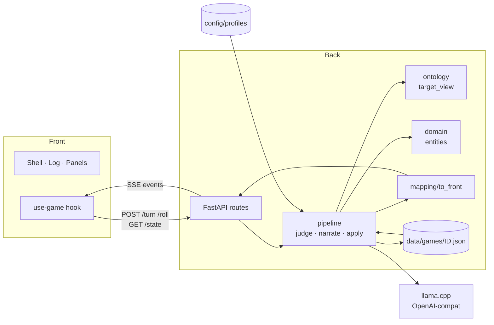
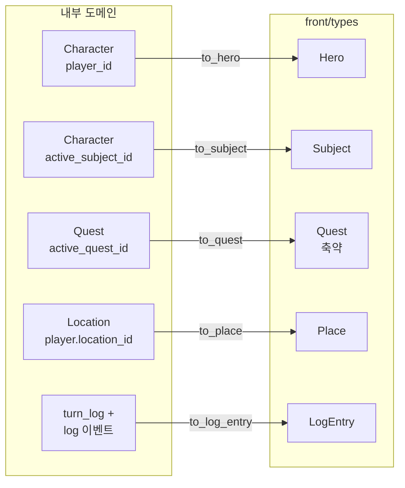
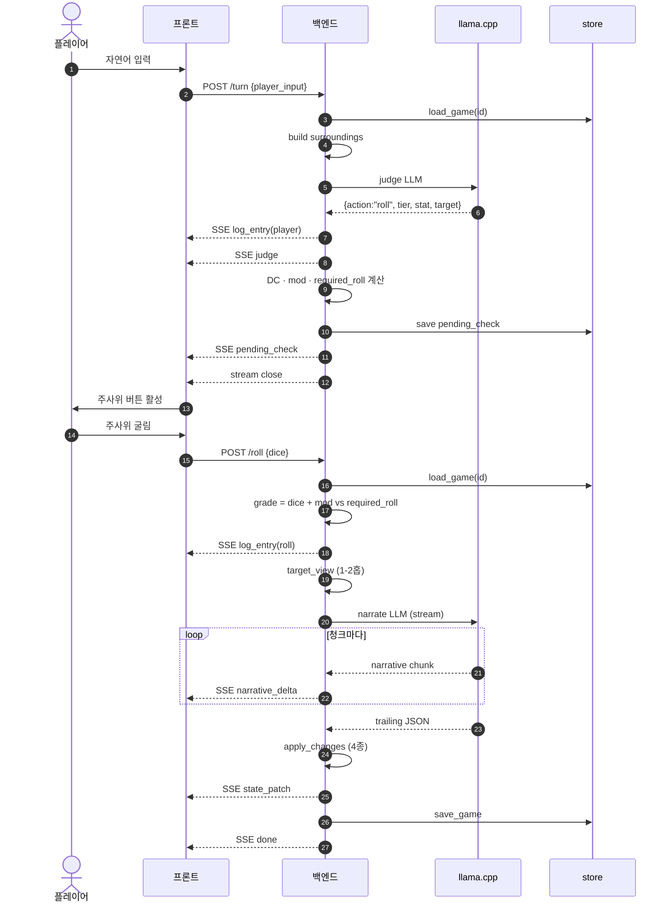

# P1 — 백엔드 턴 파이프라인과 프론트 연계

- Date: 2026-04-19
- Status: Draft
- Scope marker: P1 of {P1, P2, P3}

## 1. 목표

자연어 입력으로 한 턴이 굴러가고, 프론트 화면(Hero / Subject / Quest / Place / Log)이 실시간으로 갱신되는 백엔드를 완성한다. `legacy/docs/plan.md`의 구조를 계승하되 코드는 새로 작성하며, 전투·확장 서브시스템은 P2·P3로 미룬다.

### 한눈에 보기



## 2. 범위

### 포함 (P1)

- FastAPI 골격 유지·확장, 세션 생성·로드·저장
- 턴 파이프라인: DC 판정 → (필요 시) 플레이어 주사위 → 내러티브 → `state_changes` 적용
- 컨텍스트 조립: `surroundings`, `target_view`, 히스토리 레이어
- 도메인 스키마 (레거시 §8·§9·§10 계승)
- SSE 기반 스트리밍 wire (`judge`, `pending_check`, `narrative_delta`, `state_patch`, `log_entry`, `done`, `error`)
- 내부 도메인 → 프론트 타입 매핑 레이어
- 게임 프로필 로딩 (레거시 `config/profiles/{name}/` 구조)
- 게임당 단일 JSON 파일 저장 (`data/games/{id}.json`)
- 최소한의 메모리·호감도·월드 시간 (내러티브 톤·DC 수정자에 필요한 범위)

### 제외 (→ P2)

- 전투 루프 (`combat` action은 P1에서 에러 반환)
- 이니셔티브, 공격, 스킬, 방어, 도주, death save, combat_state

### 제외 (→ P3)

- 장비 장착/탈착, 인벤토리 무게 규칙, 거래
- 성장 루틴 (rest / train / learn)
- 퀘스트 자동 진행 (`check_quests`), 챕터·캠페인 전환
- 동반자 시스템
- 메타 액션 REST 엔드포인트 (버튼 기반 equip/rest 등)
- `rejected[]` 기반 내러티브 자가 보정 루프

## 3. 제약과 결정

| 항목 | 결정 | 비고 |
|---|---|---|
| 프론트 표면 | `front/types` 그대로 | 내부 필드는 노출하지 않음 |
| 내부 스키마 | 레거시 계승 (계산용 포함) | 코드는 새로 작성, `legacy/docs/plan.md`를 레퍼런스로 |
| LLM 런타임 | llama.cpp 단일 모델 (OpenAI-compat) | 판정·내러티브 동일 URL, 단일 `LLMClient` 재사용 |
| 상태 저장 | 파일 기반, 게임당 JSON 1개 | `data/games/{id}.json` |
| 세션 | 멀티 게임 | `game_id` 로 다중 보관 |
| 프로필 | 레거시 방식 (`config/profiles/{name}/`) | world.md + characters / locations / quests / items |
| 외부 API 모양 | 단일 SSE 다중 이벤트 + judge/narrate 호출 분리 | 접근 1 채택 |
| env 변수 | fail-fast | `HOST`, `PORT`, `BASE_URL`, `DATA_DIR` 누락 시 throw |
| 네트워크 | LAN 내부만 (인증 없음) | 외부 노출은 추후 |

## 4. 아키텍처

### 4.1 모듈 구조

```
back/
  run_api.py                     FastAPI 엔트리 (build_app, main)
  .env                           HOST, PORT, BASE_URL, DATA_DIR, PROFILE_DIR
  config/
    rules.py                     DC·시간 수치 (P1은 DC·시간만, 전투·거래 수치는 P2·P3)
    profiles/
      default/
        world.md                 세계관·톤
        characters/*.json        NPC 시드
        locations/*.json         장소 시드
        quests/*.json            퀘스트 시드
        items/*.json             아이템 시드
  data/
    games/{game_id}.json         게임 상태 (엔티티 스냅샷 + 로그 + 메모리 + 히스토리)
  src/
    api/
      routes.py                  POST /session/init, GET /session/{id}/state,
                                 POST /session/{id}/turn, POST /session/{id}/roll
      schema.py                  Pydantic wire 타입 (요청·이벤트)
      sse.py                     이벤트 직렬화, StreamingResponse 헬퍼
    pipeline/
      judge.py                   DC 판정 에이전트 호출 + JSON 파싱 + target 검증
      narrate.py                 내러티브 에이전트 호출 + stream parsing
                                 (narrative_delta + trailing JSON)
      apply.py                   state_changes 검증·적용 + rejected 로깅
      context.py                 surroundings / target_view / history 조립
      dc.py                      sigmoid DC + tier → DC + social_bonus + grade 계산
      turn.py                    turn/roll 오케스트레이터 (이벤트 방출)
    state/
      store.py                   load_game / save_game (파일 I/O)
      init.py                    프로필 → 초기 GameState
      models.py                  GameState (엔티티 딕셔너리 + 로그 + 메모리 + pending)
    ontology/
      graph.py                   구조적·의미적·config 엣지 (§8)
      target_view.py             target 기준 1-2홉 탐색 (§4.2)
    domain/
      entities.py                Character, Location, Item, Quest, Connection
      memory.py                  Memory, TurnLogEntry
      types.py                   StatKey, Tier, Grade, Intent, Action 등 enum
    llm/
      client.py                  기존 LLMClient 재사용 (OpenAI-compat 스트리밍)
      prompts/
        judge.md                 DC 판정 에이전트 시스템 프롬프트
        narrate.md               내러티브 에이전트 시스템 프롬프트
    mapping/
      to_front.py                Character → Hero / Subject, Location → Place,
                                 Quest → Quest, TurnLogEntry → LogEntry
    errors.py                    도메인 에러 타입 (InvalidTarget, PendingCheckExpected, …)
```

### 4.2 레이어 경계

- `domain/` + `ontology/` = 내부 풀 스키마. 레거시 계산 필드 포함.
- `pipeline/` = 턴 로직. 순수 파이썬, FastAPI에 의존하지 않음.
- `api/` = 얇은 어댑터. 라우팅·요청 검증·SSE 인코딩만.
- `mapping/to_front.py` = 유일한 프론트 노출 지점. 내부 필드 누출 방지의 관문.
- `state/store.py` = 파일 I/O 경계. 파이프라인은 스토어를 통해서만 저장 상태에 접근.

## 5. 데이터 모델

### 5.1 내부 도메인 (요약)

```python
class Character:
    id: str
    name: str
    race: str
    clazz: str                    # 'class' 예약어 회피
    level: int
    hp: int; hp_max: int
    mp: int; mp_max: int
    exp: int; exp_max: int
    stats: Stats                  # STR/DEX/CON/INT/WIS/CHA
    inventory_ids: list[str]      # Item.id 참조
    equipment: Equipment          # 8슬롯 (head, top, bottom, feet, leftHand, rightHand, acc1, acc2)
    status: list[str]
    basic_skills: list[str]
    learned_skills: list[str]
    companions: list[str]
    location_id: str
    relations: dict[str, int]     # target_id → affinity [0, 100]
    memories: list[Memory]
    role: str                     # 'player' | 'npc'
    disposition: dict[str, int]   # aggressive / lawful / moral 등 0..100
    tone_hint: str | None
    active_hours: str | None
    known: list[str]              # Subject 용 "특징" 태그
```

```python
class Location:
    id: str
    name: str
    description: str
    weather: list[str]
    features: list[str]
    surroundings: list[str]       # 인접 장소 이름 등 UI용 태그
    tags: list[str]
    connections: list[Connection]
    hidden_items: list[str]
    hidden_connections: list[Connection]
    search_dc: str | None
```

```python
class Quest:
    id: str
    title: str
    giver_id: str
    difficulty: Difficulty        # {value, max, label}
    goals: list[str]
    conditions: list[QuestCondition]
    fail_conditions: list[QuestCondition]
    conditions_met: list[bool]
    rewards: Rewards              # {gold, exp, items?}
    status: Literal['locked', 'active', 'completed', 'failed']
    required: bool
    memo: str
```

```python
class GameState:
    game_id: str
    profile: str
    world_time: str               # ISO 8601
    player_id: str
    active_quest_id: str | None
    active_subject_id: str | None
    characters: dict[str, Character]
    locations: dict[str, Location]
    items: dict[str, Item]
    quests: dict[str, Quest]
    pending_check: PendingCheck | None   # /turn 이 roll 로 끝난 뒤 저장되는 판정 컨텍스트
    recent_dialogue: list[DialoguePair]  # (player_input, narrative) 최근 N턴
    turn_log: list[TurnLogEntry]         # 한 줄 요약 롤링 50개
    turn_counter: int
```

`pending_check` 스키마:
```python
class PendingCheck:
    player_input: str
    action: Literal['roll']
    tier: Tier
    stat: StatKey
    target: str
    targets: list[str] | None
    dc: int                       # 기본 DC ± random_buffer 적용 후
    mod: int                      # social_bonus
    required_roll: int            # sigmoid 결과 (1..20)
    created_at: str               # ISO 8601
```

### 5.1-b 내부↔프론트 매핑 개요



### 5.2 프론트 매핑

`mapping/to_front.py`가 다음을 내놓는다.

| 프론트 타입 | 소스 | 노출 필드 |
|---|---|---|
| `Hero` | `characters[player_id]` | name, race, class, level, exp, expMax, hp, hpMax, mp, mpMax, stats, equipment, inventory, status, skills, companions |
| `Subject` | `characters[active_subject_id]` | name, role, race, class, trust(=`relations[player_id]`, 기본 50), known, level, hp, hpMax, stats, inventory |
| `Quest` | `quests[active_quest_id]` | title, giver(이름), difficulty, goals, conditions, rewards, memo |
| `Place` | `locations[characters[player_id].location_id]` | name, date, hour, weather, features, surroundings |
| `LogEntry` | `turn_log` + 이벤트 부산물 | `gm` / `player` / `act` / `roll` 4종 union |

`date` / `hour`는 `world_time`을 파싱해 분리한다. `Place.date`는 한국어 포맷 (예: "812년 4월 28일"), `hour`는 0..23.

`Subject.inventory`는 `inventory_ids`를 `items` 카탈로그와 조인하여 `{name, qty}` 배열로 만든다. 현재 프론트 타입에는 qty가 있지만 내부 `inventory_ids`는 개별 ID 목록이므로 동일 id 개수를 세서 qty로 집약한다.

## 6. 외부 API

### 6.1 엔드포인트

| 메서드 | 경로 | 바디 | 응답 |
|---|---|---|---|
| POST | `/session/init` | `{profile: string}` | `{game_id: string, state: FrontState}` |
| GET  | `/session/{id}/state` | — | `FrontState` |
| POST | `/session/{id}/turn` | `{player_input: string}` | `text/event-stream` |
| POST | `/session/{id}/roll` | `{dice: int (1..20)}` | `text/event-stream` |

`FrontState` = `{hero, subject, quest, place, log}` (프론트 타입에 맞춘 스냅샷).

### 6.2 SSE 이벤트

한 줄 JSON 형식:

```
data: {"type": "<event>", "data": {...}}\n\n
```

스트림은 반드시 `done` 또는 `error` 로 종료한다.

| type | data | 시점 |
|---|---|---|
| `judge` | `{action, tier?, stat?, target?, targets?, question?}` | turn 에서 judge LLM 호출 직후 |
| `pending_check` | `{dc, stat, mod, required_roll, tier, target}` | action=roll 확정 시. 직후 스트림 종료 |
| `narrative_delta` | `{text}` | narrate LLM 이 텍스트 청크 방출할 때마다 |
| `state_patch` | `{hero?, subject?, quest?, place?}` | apply 후 변경된 슬롯만 |
| `log_entry` | `LogEntry` | 새 로그 아이템 (`player` / `act` / `roll`). `gm` 은 `narrative_delta` 축적으로 생성되므로 이벤트로 보내지 않는다 |
| `done` | `{}` | 턴 종료 |
| `error` | `{message, code?}` | 복구 불가 오류 (세션 없음, pending 불일치 등) |

### 6.3 턴 라이프사이클

#### 분기 개요

```mermaid
flowchart LR
  A[/turn 수신] --> B[judge LLM]
  B --> C{action?}
  C -- skip --> D[narrate LLM 스트림]
  D --> E[apply · state_patch]
  E --> F[done]
  C -- roll --> G[pending_check 저장 · 이벤트]
  G --> H[stream close]
  H --> R[/roll 수신]
  R --> K[grade 판정]
  K --> L[log_entry roll]
  L --> M[narrate LLM 스트림]
  M --> N[apply · state_patch]
  N --> F
  C -- clarify --> I[log_entry act 되물음]
  I --> F
  C -- combat --> J[error CombatNotSupported]
```

#### roll 분기 시퀀스 상세



- `/roll` 을 `pending_check` 없이 호출하면 `error: PendingCheckExpected`.
- `/turn` 을 `pending_check` 상태에서 호출하면 `error: PendingCheckActive` (P1은 재시도/취소 엔드포인트 없음).

## 7. 턴 파이프라인

### 7.1 `POST /turn`

1. `store.load_game(id)` → `GameState` 로드. pending_check 이 있으면 `PendingCheckActive` 로 종료.
2. `context.build_surroundings(state)` — 현재 장소·주변 엔티티 상태 태그.
3. `judge_llm(player_input, surroundings)` — `{action, tier, stat, target, targets?, question?}` JSON. 재시도 1회.
4. target 검증: `characters|locations|items` 키에 존재? 없으면 judge 재호출 1회 → 여전히 실패면 현재 location 으로 폴백.
5. 이벤트: `log_entry(kind=player, text=player_input)` → `judge`.
6. action 분기:
   - **skip** — 곧장 7.3 으로 (grade 없이, target_view 없이, narrate 만).
   - **roll** — `dc.compute(tier, stat_value, rules)` → DC 산출 → `dc.social_mod(actor, target, state, rules)` → mod 산출 → `dc.sigmoid_required_roll(dc, stat_value)` → required_roll.
     `state.pending_check = PendingCheck(...)` → `store.save_game` → 이벤트: `pending_check` → 스트림 종료.
   - **combat** — P1 미지원. `error: CombatNotSupported` → 종료.
   - **clarify** — 이벤트: `log_entry(kind=act, text=question)` → `done`.

### 7.2 `POST /roll`

1. `store.load_game(id)` → pending_check 없으면 `PendingCheckExpected` 종료.
2. `grade = dc.grade(dice, pending.required_roll, pending.mod, rules)` — critical_success/success/partial_success/failure/critical_failure (원본 주사위 기준 critical 판정).
3. 프론트 노출용 이진 결과 `result = 'success' if grade in (critical_success, success, partial_success) else 'fail'`.
4. 이벤트: `log_entry(kind=roll, check=stat, dc, roll, mod, result)`.
5. `target_view = ontology.target_view.build(state, pending.target)` — 1-2홉.
6. 7.3 (내러티브) 호출. 이때 judge 결과와 grade, dice 값을 함께 전달.
7. `state.pending_check = None` → save.

### 7.3 내러티브 서브루틴 (skip 과 roll 공통)

입력: `player_input`, `judge_result`, `grade?`, `surroundings`, `target_view?`, `history = recent_dialogue + turn_log`.

1. `narrate_llm(...)` — 스트리밍. 본문은 자연어, 마지막 블록은 delimiter 뒤 JSON:
   ```
   <서술 본문>
   ---JSON---
   {"summary": "...", "state_changes": [...], "memorable": true, "memory_targets": [...], "memory": "...", "importance": 2}
   ```
2. delimiter 이전 청크는 `narrative_delta` 이벤트로 방출.
3. delimiter 이후 JSON 을 파싱:
   - `apply.apply_changes(state, state_changes)` — `set | move | move_item | affinity` 4종만 허용. 위반 항목은 `rejected[]` 로 로깅 (내러티브 재호출 없음).
   - 4종 외 타입, 엔진 전용 필드(HP/MP/xp/gold/alive/…), list 필드(relations/inventory_ids/memories/goals/…)의 `set`은 거부.
   - `move` / `move_item` / `affinity` 적용 시 관련 엔티티 캐시 갱신.
4. 프론트 상태 비교: 바뀐 슬롯만 `state_patch` 로 전송.
5. `recent_dialogue.append((player_input, narrative_full))`, `turn_log.append({turn, target, summary})`. 상한(`rules.memory.recent_dialogue_turns` 기본 5 / turn_log 50) 초과 시 오래된 것부터 drop.
6. `memorable` 이면 `memory_targets` 각 엔티티 `memories[]` 에 저장. 엔티티당 cap 도달 시 importance 낮은 것 → 오래된 것 순으로 제거.
7. `state.turn_counter += 1`, 월드 시간은 P1에서는 "턴당 1분" 고정 (상세 규칙은 P3).
8. `store.save_game` → 이벤트: `done`.

> 노트: `narrative_delta` 청크들이 프론트에서 축적되어 한 개의 `gm` LogEntry 로 렌더된다. 백엔드는 별도로 `log_entry(kind=gm)` 이벤트를 방출하지 않는다. `turn_log` 에는 `summary` 만 저장한다 (전체 본문은 `recent_dialogue` 가 보관).

### 7.4 DC 계산 (`pipeline/dc.py`)

```python
tier_to_dc = {'easy': 5, 'moderate': 10, 'hard': 15, 'very_hard': 20}

def compute_dc(tier, rules):
    base = tier_to_dc[tier]
    return base + randint(-rules.random_buffer, rules.random_buffer)

def sigmoid_required_roll(dc, stat_value, k=0.5):
    raw = 20 / (1 + exp(-k * (dc - stat_value)))
    return clamp(round(raw), 1, 20)

def social_mod(actor, target_id, state, rules):
    aff = state.characters[actor].relations.get(target_id, 50)
    if aff >= 50 + rules.friendly_threshold: return +rules.roll_bonus
    if aff <= 50 - rules.friendly_threshold: return -rules.roll_bonus
    return 0

def grade(dice, required_roll, mod, rules):
    total = dice + mod
    if dice >= rules.critical_hit_threshold: return 'critical_success'
    if dice <= rules.critical_miss_threshold: return 'critical_failure'
    if total >  required_roll: return 'success'
    if total == required_roll: return 'partial_success'
    return 'failure'
```

`rules.social`에는 `friendly_threshold=20`, `roll_bonus=2`, `random_buffer=2`, `critical_hit_threshold=20`, `critical_miss_threshold=1` 기본값.

### 7.5 내러티브 state_changes 허용 목록 (P1)

- `{type: 'set', entity: 'characters'|'items'|'locations', id, field, value}` — 점 표기 경로. list 필드·엔진 전용 필드는 금지.
- `{type: 'move', target: char_id, destination: location_id}`
- `{type: 'move_item', item: item_id, from: holder_id, to: holder_id}`
- `{type: 'affinity', actor: char_id, target: char_id, grade, intent}`

`affinity` 는 엔진이 `rules.social` 기반으로 delta 산출. narrator 는 숫자 지정 금지.

## 8. LLM 프롬프트

### 8.1 `llm/prompts/judge.md`

- 입력: player_input + surroundings 요약
- 출력: 단일 JSON (`action`, `tier`, `stat`, `target`, `targets?`, `question?`)
- 규율: 플레이어 스탯을 모른 채 판단. 대상 미지정 시 현재 location 을 target 으로. 분해 불가하면 `clarify`.

### 8.2 `llm/prompts/narrate.md`

- 입력: world_layer(world.md) + session 요약 + history + surroundings + target_view + judge_result + grade
- 출력: 본문(한국어 2인칭, 3-6문장) + `---JSON---` delimiter 뒤 JSON
- 규율: 수치/DC 노출 금지. HP·XP·골드 변경은 state_changes 로만. NPC 톤은 target_view.tone_hint 를 따름.

프롬프트는 legacy/docs/plan.md §2 를 요약해 한 페이지 이내로 유지한다.

## 9. 상태 저장

### 9.1 파일 레이아웃

- 디렉토리: `data/games/` 하나만. 게임당 파일 1개: `{game_id}.json`.
- 내용: `GameState` 전체 덩이 (엔티티 스냅샷 + pending_check + recent_dialogue + turn_log + memories).
- `save_game` 은 원자적 쓰기 (`.tmp` 에 쓰고 `os.replace`).
- 동시성: P1 은 단일 사용자 가정. 프로세스 레벨 asyncio Lock 1개로 직렬화.

### 9.2 초기화 (`state/init.py`)

1. `profiles/{profile}/characters/*.json` 등을 읽어 카탈로그 생성.
2. 플레이어 엔티티는 프로필의 `player_template.json` 에서 인스턴스화.
3. 시작 장소·활성 퀘스트·활성 subject 는 프로필의 `start.json` 에서 지정.
4. `game_id` = `uuid4().hex[:12]`.
5. `world_time` 은 프로필 `start.json` 에서.

## 10. 설정과 환경

`run_api.py` 가 기동 시 다음 env 를 fail-fast 로 읽는다.

| 변수 | 용도 | 예시 |
|---|---|---|
| `HOST` | FastAPI 바인드 | `0.0.0.0` |
| `PORT` | 서비스 포트 | `8000` |
| `BASE_URL` | llama.cpp OpenAI-compat URL | `http://127.0.0.1:8080/v1` |
| `DATA_DIR` | 게임 저장 루트 | `./data` |
| `PROFILE_DIR` | 프로필 루트 | `./config/profiles` |
| `DEFAULT_PROFILE` | `/session/init` 기본 profile 이름 | `default` |

누락 시 즉시 throw (메모리 feedback: env fail-fast).

## 11. 에러 처리

| 상황 | 응답 |
|---|---|
| `game_id` 없음 | HTTP 404 `{error: "game not found"}` |
| `/turn` 중 pending_check 활성 | SSE `error: PendingCheckActive` |
| `/roll` 중 pending_check 없음 | SSE `error: PendingCheckExpected` |
| `/roll` 의 dice 범위 밖 (1..20) | HTTP 400 |
| judge JSON 파싱 실패 | 재시도 1회 → 실패 시 SSE `error: JudgeMalformed` |
| judge target 유효성 2회 연속 실패 | 현재 location 으로 폴백 |
| narrate JSON 파싱 실패 | 내러티브만 log 로 남기고 `state_changes` 없이 `done`. rejected[] 에 기록 |
| narrate state_change 스키마 위반 | 해당 항목 drop + rejected[] 로깅, 나머지는 적용 |
| LLM 연결 실패 | SSE `error: LLMUnavailable` 후 종료 |
| 저장 실패 | SSE `error: PersistenceFailed`, in-memory 상태는 롤백 |

내러티브 자가 보정 루프(rejected[] → narrator 재호출)는 P1 에서 도입하지 않는다 (로깅만).

## 12. 테스트 전략

- 단위 테스트
  - `dc.py`: tier → DC, sigmoid required_roll, social_mod, grade (경계값·critical)
  - `apply.py`: 허용 4종 정상 적용, 위반 항목 rejected[], list 필드·엔진 전용 필드 거부
  - `ontology.target_view`: NPC / Location / 오브젝트 각각에 대해 1-2홉 결과 검증
  - `mapping.to_front`: 내부 필드가 프론트 타입에 새지 않는지 (snapshot 비교)
- 통합 테스트
  - FastAPI TestClient + 더미 `LLMClient` (판정·내러티브 고정 응답)
  - 시나리오 1: skip → narrative → state_patch → done
  - 시나리오 2: roll → pending_check → /roll → narrative → log(roll) → done
  - 시나리오 3: pending 중 /turn 재진입 → error
- 수동 스모크
  - llama.cpp 실제 서버 연결, 프론트에서 한 턴 진행, Hero/Subject/Quest/Place/Log 갱신 확인

## 13. 성공 기준

1. `back/run_api.py` 기동 후 프론트(LAN)의 `EXPO_PUBLIC_API_URL` 을 가리켜 `/session/init` → 초기 Hero/Subject/Quest/Place/Log 로드.
2. 프론트에서 자연어 턴 입력 시 SSE 이벤트가 순서대로 도착하고, narrative 가 점진 표시된다.
3. DC 판정이 `roll` 이면 프론트 주사위 버튼이 활성화되고, 굴리면 narrative 가 이어진다.
4. 한 턴이 끝나면 Hero/Subject/Quest/Place 중 바뀐 슬롯이 `state_patch` 로 갱신된다.
5. 게임 재시작(서버 재기동) 후 같은 `game_id` 로 `GET /state` 가 같은 스냅샷을 반환한다.
6. `front/debug/` 의 mock 상수 의존이 프론트에서 제거 가능한 상태가 된다 (프론트 리팩터는 범위 밖, 백엔드가 동등한 데이터를 모두 공급).

## 14. P1 이후 열린 이슈

- `combat` action 이 나오면 P1 은 에러로 종료 → P2 에서 combat_state 도입.
- 장비 장착/거래/성장 자연어 표현: P1 은 내러티브 `move_item` 으로만 간접 반영. P3 에서 명시적 엔드포인트.
- 퀘스트 조건 자동 평가: P1 은 수동 `set quests.{id}.status` 로만. P3 에서 trigger 엔진.
- 월드 시간 세밀화 (이동·휴식·전투 턴별 경과): P3.
- `rejected[]` 기반 내러티브 재호출 루프: P3 이후.
