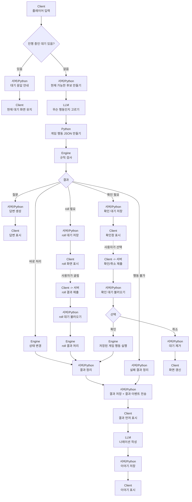

# LLM 파이프라인

## 한 줄 요약

LLM은 플레이어 말뜻을 고르고, Python과 Engine은 실제 게임 처리를 합니다.

```text
LLM은 고른다.
Python은 만든다.
Engine은 처리한다.
```

이 파일은 전체 흐름을 먼저 보는 문서입니다. 세부 계약은 `01-contract.md`, 런타임 순서는 `02-runtime.md`, 화면 데이터는 `05-interfaces.md`, API와 저장 방식은 `06-storage-api.md`를 따릅니다.

## 전체 흐름



## 단계 설명

### 1. 대기 상태 먼저 확인

`pending_roll`이나 `pending_confirmation`이 남아 있으면 새 플레이어 입력을 받지 않습니다.

예를 들어 주사위를 굴려야 하는 상태라면, 새 행동을 해석하지 않고 roll 결과 제출을 기다립니다.

### 2. 현재 가능한 후보 만들기

서버가 현재 graph를 보고 지금 가능한 것만 모읍니다. 이 후보 목록이 LLM에게 보내는 입력입니다.

예:

- 갈 수 있는 장소
- 보이는 NPC
- 공격 가능한 대상
- 상인이 파는 물건
- 플레이어 인벤토리
- 플레이어 기술

이 후보는 서버가 만듭니다. LLM이 만들면 안 됩니다.

### 3. LLM은 의도와 대상만 고르기

LLM은 플레이어 말이 무슨 뜻인지 고릅니다. 여기서 `intent`는 `buy`, `move`, `attack` 같은 행동 뜻입니다.

예:

```json
{
  "intent": "buy",
  "merchant_id": "merchant_01",
  "item_id": "potion_01"
}
```

LLM은 최종 게임 행동 JSON을 만들지 않습니다.

### 4. Python이 게임 행동 JSON 만들기

Python은 LLM이 고른 값이 진짜 후보 안에 있는지 확인합니다.

그 다음 게임에서 쓰는 행동 JSON을 만듭니다.

예:

```json
{
  "actions": [
    {
      "verb": "transfer",
      "what": "potion_01",
      "from": "merchant_01",
      "to": "player_01",
      "how": "trade"
    }
  ]
}
```

### 5. Engine이 실제 처리

Engine은 게임 행동이 가능한지 검사합니다.

예:

- 돈이 충분한가?
- 상인이 그 물건을 갖고 있는가?
- 대상이 공격 가능한가?
- 아이템을 사용할 수 있는가?

Engine 결과는 크게 다섯 가지입니다.

```text
바로 처리
행동 불가
질문
roll 필요
확인 필요
```

### 6. 결과를 먼저 Client에 보냄

Engine이 성공/실패를 정하면 그 결과를 먼저 저장하고 Client에 보냅니다.

이유는 UI가 성공/실패, roll 결과, 상태 변경을 먼저 보여줄 수 있어야 하기 때문입니다.

그 다음 LLM이 나레이션을 씁니다. 이 흐름은 한 번에 응답을 끝내는 방식보다, `결과 이벤트`를 먼저 보내고 `나레이션 이벤트`를 나중에 보내는 방식에 가깝습니다.

### 7. LLM은 나레이션만 작성

나레이션 단계에서 LLM은 게임 결과를 새로 정하지 않습니다.

LLM은 이미 정해진 결과를 플레이어에게 보여줄 문장으로 바꿉니다.

### 8. roll 흐름

roll이 필요하면 서버는 `pending_roll`을 저장하고 Client는 roll 화면을 보여줍니다.

사용자가 roll 결과를 보내면 서버는 저장된 게임 행동을 이어서 처리합니다.

이때 LLM으로 의도를 다시 고르지 않습니다.

### 9. confirmation 흐름

확인이 필요하면 서버는 `pending_confirmation`을 저장하고 Client는 확인창을 보여줍니다.

사용자가 확인을 누르면 저장된 게임 행동을 실행합니다.

사용자가 취소를 누르면 대기 상태만 제거하고 게임 행동은 실행하지 않습니다.

## 구현 범위

새 구조로 바꿀 때 기존 행동을 모두 지원합니다.

```text
move
talk
attack
buy
query
pass
sell
equip
unequip
use
cast
rest
give
steal
loot
accept quest
abandon quest
복합 행동
```

구현은 작은 단위로 나눠서 하되, 새 구조로 전환할 때는 기존 `classify`가 처리하던 행동이 빠지지 않아야 합니다.

## 중요한 규칙

```text
LLM은 context를 만들지 않는다.
LLM은 최종 게임 행동 JSON을 만들지 않는다.
LLM은 성공/실패를 정하지 않는다.
LLM은 결과를 문장으로만 바꾼다.
```
