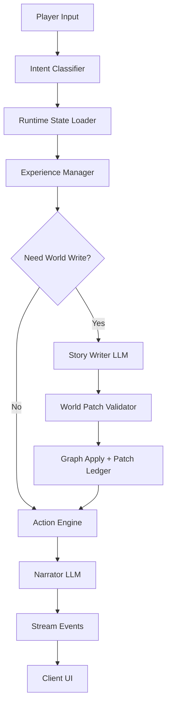

# 최소 시드 기반 LLM TRPG를 위한 서버-UI 공동 설계

## — 플레이어의 행동이 세계를 쓰게 만드는 Contract-Driven Dynamic Narrative Architecture

## 초록

현재 `phykn/trpg` 프로젝트는 한국어 TRPG를 목표로 하며, LLM이 플레이어 의도를 분류하고 나레이션을 쓰고, 엔진이 상태·규칙·굴림·시간을 처리하는 구조를 갖고 있다. 프로젝트 README도 이 책임 분리를 명확히 설명한다.  서버는 FastAPI, Pydantic v2, OpenAI-compatible LLM, Supabase 기반 그래프 저장소를 사용하고, 클라이언트는 Expo React Native 단일 화면 앱으로 구성되어 있다.

그러나 현재의 시나리오 제작 방식은 복잡한 seed entity를 먼저 만들고, 런타임에서는 그 seed를 읽어 진행하는 구조에 가깝다. `agency/story` 도구 역시 한국어 산문 하나를 완성된 시나리오 디렉토리로 분해·검증·빌드하는 워크플로를 지향한다.  이는 안정성과 검증 가능성은 높지만, 사용자가 원하는 “플레이어마다 다른 스토리”와는 긴장이 있다. 본 논문은 이 문제를 해결하기 위해 **시드를 스토리 데이터베이스가 아니라 생성 규칙 계약서로 축소**하고, 서버에는 **LLM writer agent + world patch validator + graph persistence**를 추가하며, UI에는 **생성된 세계가 플레이어에게 ‘발견’으로 보이도록 하는 다층 인터페이스**를 제안한다.

핵심 결론은 다음과 같다.

> LLM TRPG의 재미는 “LLM이 긴 문장을 잘 쓰는 것”이 아니라, **플레이어가 건드린 대상이 실제 세계 상태로 저장되고, 이후 장면에서 다시 돌아오는 것**에서 발생한다.
> 따라서 서버는 prose generator가 아니라 **검증 가능한 세계 변경 시스템**이어야 하며, UI는 채팅창이 아니라 **세계가 자라는 감각을 보여주는 플레이 표면**이어야 한다.

---

## 1. 문제 정의

### 1.1 현재 구조의 장점

현재 프로젝트는 이미 중요한 기반을 갖고 있다.

서버에는 graph session init, state load, input, explicit turn, confirm, roll, combat, level-up 등 TRPG 진행에 필요한 REST route가 존재한다.   클라이언트도 `/session/{game_id}/graph/input/stream` 같은 스트리밍 경로를 호출하고, `narration_delta`, `result`, `final`, `error` 이벤트를 읽는 구조를 이미 갖고 있다.

즉, 완전히 새로 만들 필요는 없다.
현재 구조 위에 **“읽기 전용 시나리오”를 “쓰기 가능한 런타임 세계”로 바꾸는 레이어**를 얹으면 된다.

### 1.2 현재 구조의 재미상 한계

현재 seed 중심 구조의 한계는 다음이다.

```text
1. 시나리오가 사전에 많이 써져 있어야 한다.
2. 플레이어가 예상 밖 행동을 하면, LLM은 기존 seed 안에서만 답변한다.
3. 새 장소, 새 인물, 새 단서가 생겨도 graph에 저장되지 않으면 다음 턴에서 사실이 되지 않는다.
4. 결과적으로 “LLM이 스토리를 직접 쓴다”보다 “LLM이 준비된 스토리를 말한다”에 가까워진다.
```

이 문제는 단순히 prompt를 길게 쓴다고 해결되지 않는다.
LLM이 만든 내용을 **상태로 저장하는 서버 구조**와, 저장된 변화가 **플레이어에게 보이는 UI 구조**가 함께 필요하다.

### 1.3 목표

본 설계의 목표는 다음과 같다.

```text
G1. 시드는 최소화한다.
G2. 플레이어 행동에 따라 사건, 단서, 장소, 임시 NPC, 기억이 생성된다.
G3. LLM이 생성한 내용은 반드시 world_patch로 저장된다.
G4. 서버는 생성 내용을 검증하고 graph에 반영한다.
G5. UI는 생성된 세계를 디버그 정보가 아니라 플레이 경험으로 보여준다.
G6. 핵심 세계관과 금지선은 contract로 유지한다.
```

---

## 2. 배경 이론

### 2.1 MDA: 재미는 기능이 아니라 동역학에서 나온다

MDA 프레임워크는 게임을 Mechanics, Dynamics, Aesthetics로 나누어 설명한다. 원 논문은 mechanics를 데이터 표현과 알고리즘 수준의 구성요소, dynamics를 player input과 시스템 출력이 시간에 따라 만드는 런타임 행동, aesthetics를 플레이어에게 유발되는 정서적 반응으로 정의한다. ([노스웨스턴 컴퓨터 과학][1])

이 관점에서 LLM TRPG의 “재미 기능”은 LLM 호출 그 자체가 아니다.

```text
Mechanics:
- world_patch 생성
- patch 검증
- graph 저장
- memory 회수
- 선택 흔적 표시

Dynamics:
- 플레이어가 조사한 곳에 새 단서가 생김
- 반복 언급한 물건이 중요해짐
- 선택 결과가 다음 장면에 돌아옴
- 동행자가 플레이어 행동에 반응함

Aesthetics:
- 내가 만든 이야기라는 감각
- 발견
- 표현
- 긴장
- 회상
- 의미 있는 선택
```

MDA 논문은 플레이어 경험을 기능 목록에서 직접 만들 수 없고, mechanics가 dynamics를 거쳐 aesthetics를 낳는다고 본다. ([노스웨스턴 컴퓨터 과학][1]) 따라서 이 프로젝트의 서버 UI 설계도 “LLM 자유입력” 자체가 아니라, 자유입력이 **세계 변화로 이어지는 메커닉**을 설계해야 한다.

### 2.2 Interactive Drama와 Drama Manager

`Façade`는 2005년 출시된 AI 기반 interactive drama로, 플레이어가 텍스트 입력으로 두 캐릭터와 대화하고, 시스템은 believable agents와 drama manager를 통해 갈등과 해소 방향을 조직했다. ([위키백과][2]) 여기서 중요한 교훈은 “자유 대화”만으로는 드라마가 생기지 않는다는 것이다. 드라마는 대화 뒤에 있는 **상태, 긴장, 진행 제어자**가 만들어낸다.

LLM TRPG에서도 narrator 하나만 있으면 대화는 생기지만 드라마는 약해진다.
따라서 다음 역할 분리가 필요하다.

```text
narrator:
- 이미 확정된 세계를 말한다.

writer:
- 새 세계 요소를 제안한다.

validator:
- 제안이 contract와 graph 규칙을 지키는지 검사한다.

experience manager:
- 너무 산만하거나 정체된 흐름을 조절한다.
```

### 2.3 Experience Management: 고정 플롯이 아니라 경험 목표를 관리한다

Experience Management 연구는 게임 같은 상호작용 경험을 특정 플레이어와 설계 목표에 맞게 자동 조정하는 AI 시스템을 다룬다. Zhu와 Ontañón은 EM이 수십 년간 탐구되어 왔고, 설계 목표를 만족시키기 위해 경험을 자동으로 조정하는 문제라고 정리한다. ([arXiv][3])

이 프로젝트에 적용하면, 서버는 “다음 줄거리”를 고정하지 말고 다음과 같은 경험 목표를 관리해야 한다.

```text
- 최근 3턴 동안 새 발견이 없으면 clue 생성 확률을 높인다.
- 플레이어가 같은 NPC에게 반복 질문하면 knowledge나 memory를 생성한다.
- 새 장소가 너무 많으면 현재 장소의 단서를 회수한다.
- 긴장이 높으면 선택/확인 UI를 띄운다.
- 너무 많은 분기가 열리면 하나를 quest_beat로 정리한다.
```

즉 LLM이 story를 만들되, 서버는 “무엇을 생성할지”에 대한 **경험 관리자** 역할을 해야 한다.

### 2.4 Procedural Content Generation과 LLM

PCGML 조사는 머신러닝 기반 절차적 콘텐츠 생성을 게임 맵, interactive fiction story, card 등 기능적 게임 콘텐츠 생성에 적용할 수 있으며, co-creativity, repair, critique, content analysis에도 유용하다고 설명한다. ([arXiv][4]) 최근 PANGeA는 LLM을 사용해 turn-based RPG의 setting, key items, NPC를 생성하고, 자유 입력이 narrative scope를 벗어나는 문제를 validation system과 server-side memory로 다루는 구조를 제시했다. ([arXiv][5])

여기서 얻을 수 있는 구현 원칙은 명확하다.

```text
LLM은 생성한다.
서버는 기억한다.
검증기는 경계를 지킨다.
UI는 생성 결과를 플레이 가능한 단서로 보여준다.
```

### 2.5 LLM Dungeon Master 보조 연구

CALYPSO는 LLM을 D&D Dungeon Master 보조 인터페이스로 사용하며, DM이 게임 설정을 이해하고 장면을 제시하고 플레이어 상호작용에 대응해야 하는 인지 부담을 줄이는 것을 목표로 한다. 연구는 LLM이 DM에게 고충실도 presentation text와 저충실도 brainstorming idea를 제공할 수 있다고 보고한다. ([arXiv][6])

이 프로젝트는 사람 DM이 없는 구조이므로 더 엄격해야 한다.
CALYPSO처럼 “아이디어 제공”에 머물 수 없고, LLM 생성물이 실제 상태가 되기 때문에 다음이 필요하다.

```text
- 생성 제안과 확정 상태의 분리
- patch ledger
- rollback
- validator
- player-visible state
```

### 2.6 D&D as Dialogue Challenge: 상태 추적이 핵심이다

D&D를 dialogue challenge로 본 연구는 다음 발화 생성뿐 아니라 dialogue history로부터 game state를 예측하는 일을 핵심 과제로 둔다. 해당 데이터셋은 약 900개 게임, 7,000명 플레이어, 800,000개 dialogue turn, 500,000개 dice roll, 5,800만 단어 규모라고 보고한다. ([arXiv][7])

이 관점에서 LLM TRPG 서버의 핵심은 “말을 잘하기”가 아니라 **말과 상태를 함께 추적하기**다.

```text
나쁜 구조:
LLM이 장면을 말함 → 끝

좋은 구조:
LLM이 세계 변경 제안 → 서버가 검증 → graph에 저장 → narrator가 저장된 세계를 말함
```

### 2.7 Generative Agents: 기억, 반성, 계획

Generative Agents 연구는 LLM 에이전트가 관찰을 memory에 저장하고, 시간이 지나며 reflection을 만들고, planning을 통해 believable behavior를 생성하는 architecture를 제시했다. ([arXiv][8])

TRPG에 그대로 적용하면, NPC와 세계도 다음 세 층을 가져야 한다.

```text
observation:
- 플레이어가 무엇을 했는가

memory:
- 이 행동이 세계에 어떤 흔적으로 남았는가

reflection:
- 동행자나 NPC가 그 행동을 어떻게 해석하는가

planning:
- 다음 장면에서 어떤 단서/반응으로 돌아오는가
```

---

## 3. 설계 명제

본 논문의 핵심 명제는 다음이다.

> **최소 시드 LLM TRPG는 “채팅 UI”가 아니라 “세계 쓰기 UI”여야 한다.**
> 플레이어는 문장을 입력하지만, 서버는 그 문장을 세계 변경 후보로 해석하고, UI는 그 변경이 세계 안에서 감지되게 해야 한다.

이를 위해 다음 다섯 가지 원칙을 둔다.

### 원칙 1. Seed는 story가 아니라 contract다

기존 seed는 장소, 캐릭터, 아이템, 퀘스트, 챕터를 모두 들고 있었다.
최소 seed 모드에서는 다음만 들고 있어야 한다.

```text
- 세계의 정체성
- 시작 장소
- 고정 동행자
- 말투와 분위기
- 금지선
- 생성 규칙
- 엔딩의 형태
```

### 원칙 2. LLM write는 prose가 아니라 patch다

LLM이 이런 문장을 바로 쓰면 안 된다.

```text
“골목 뒤에는 말없는 아이가 있었습니다.”
```

대신 먼저 구조화된 patch가 필요하다.

```json
{
  "op": "add_character",
  "id": "char_silent_child_01",
  "name": "말없는 아이",
  "role": "witness",
  "location_id": "loc_back_alley",
  "stability": "scene"
}
```

그 다음 narrator가 이 확정된 patch를 바탕으로 장면을 말한다.

### 원칙 3. 생성된 것은 항상 origin과 stability를 가진다

동적 생성 세계가 망가지지 않으려면, 모든 생성물에 수명을 붙여야 한다.

```text
core:
- seed에 있는 고정 요소

campaign:
- 엔딩까지 유지되는 선택 흔적

chapter:
- 현재 섬/사건 동안 유지되는 요소

scene:
- 지금 장면에서만 쓰이는 임시 단서나 NPC
```

### 원칙 4. UI는 “생성됨”을 보여주지 말고 “발견됨”을 보여준다

플레이어에게 이렇게 보여주면 안 된다.

```text
[시스템] 새 location이 생성되었습니다.
```

대신 이렇게 보여줘야 한다.

```text
창고 뒤편으로 돌아서자, 아직 마르지 않은 발자국이 벽 쪽으로 끊깁니다.
```

개발자 UI에서는 patch가 보여야 하지만, 플레이어 UI에서는 diegetic discovery로 보여야 한다.

### 원칙 5. UI는 기억을 감각화해야 한다

LLM이 만든 세계가 살아 있다고 느껴지려면, 이전 선택이 계속 돌아와야 한다.

```text
- 들고 있는 물건 chip
- 남겨둔 물건의 회상
- 동행자의 짧은 반응
- 다시 등장하는 단어
- 마지막 장면의 배치
```

---

## 4. 제안 아키텍처

### 4.1 전체 구조



현재 프로젝트는 이미 classify, graph runtime, narration, streaming response의 기반을 갖고 있다. 서버 문서에 따르면 graph runtime은 `graph_intro`, `classify`, `graph_narrate`, `combat_narrate`, `recommend`를 호출하고, agent별 LLM routing도 가능하다. 다만 현재 structured call module은 `classify`가 기준이며, graph/combat narration과 recommendation은 runtime prompt를 사용한다.

여기에 새 agent를 하나 추가한다.

```text
story_write
```

이 agent는 나레이션을 쓰지 않는다.
오직 world_patch를 쓴다.

---

### 4.2 서버 컴포넌트

### 4.2.1 Story Contract Loader

최소 시나리오는 다음 파일로 시작한다. 아래 이름은 공유 설계 문서용 중립 예시이며, 특정 시나리오의 lore나 quest beat를 공통 규칙으로 올리지 않는다.

```text
scenarios/generated_contract_demo/
  profile.json
  contract.json
  start.json
  seeds/
    companion.json
    start_area.json
```

`contract.json` 예시:

```json
{
  "id": "generated_contract_demo",
  "name": "최소 시드 생성형 모드 예시",
  "language": "ko",
  "tone": {
    "voice": "2인칭 존댓말 합니다체",
    "sentence_style": "짧고 관찰 중심",
    "emotion_rule": "플레이어 감정을 단정하지 않고 물건과 행동으로 보입니다."
  },
  "fixed_elements": [
    "고정 동행자는 시작부터 함께합니다.",
    "시작 지역은 여러 장면으로 확장될 수 있습니다.",
    "각 장면에는 작은 사건과 남는 물건이 있습니다.",
    "마지막 도착지는 contract가 정합니다."
  ],
  "generation_rules": {
    "per_scene_limits": {
      "new_locations": 1,
      "new_characters": 1,
      "new_clues": 2,
      "new_items": 1,
      "new_memories": 1
    },
    "island_shape": [
      "보이는 물건",
      "작은 사건",
      "두 개의 부분 진실",
      "조사 또는 대화",
      "가져갈지 놓아둘지의 선택"
    ],
    "forbid": [
      "최종 목적지를 조기 공개하지 않습니다.",
      "고정 동행자의 정체를 임의 변경하지 않습니다.",
      "선악 점수로 결말을 판정하지 않습니다.",
      "플레이어의 감정을 확정하지 않습니다."
    ]
  },
  "ending_rule": {
    "fixed": "마지막 도착지는 contract가 정합니다.",
    "dynamic": "앞선 memory와 carried_items에 따라 마지막 장면의 물건 배치가 달라집니다."
  }
}
```

### 4.2.2 Story Writer

Story Writer 입력:

```json
{
  "contract": "...",
  "current_state": "...",
  "recent_history": "...",
  "player_input": "창고 뒤로 가볼게요.",
  "intent": {
    "kind": "explore",
    "target_text": "창고 뒤"
  },
  "generation_budget": {
    "new_locations": 1,
    "new_characters": 1,
    "new_clues": 2
  }
}
```

Story Writer 출력:

```json
{
  "reason": "플레이어가 현재 장소의 뒤편을 조사하려 했고, 기존 graph에 해당 장소가 없습니다.",
  "patches": [
    {
      "op": "add_location",
      "id": "loc_back_alley_001",
      "name": "창고 뒤 골목",
      "description": "젖은 밧줄과 낮은 나무문이 있는 좁은 골목입니다.",
      "connect_from": "loc_fog_harbor",
      "stability": "scene"
    },
    {
      "op": "add_clue",
      "id": "clue_wet_footprints_001",
      "title": "젖은 발자국",
      "summary": "발자국은 골목 안쪽에서 끊깁니다.",
      "location_id": "loc_back_alley_001",
      "visibility": "public",
      "stability": "scene"
    }
  ],
  "narration_brief": "플레이어가 창고 뒤 골목과 젖은 발자국을 발견하는 장면으로 이어가세요."
}
```

### 4.2.3 Patch Validator

validator는 다음을 검사한다.

```text
1. JSON schema 검증
2. op 허용 목록 확인
3. id 중복 확인
4. current graph에 연결되는지 확인
5. core node를 수정하지 않는지 확인
6. contract.forbid 위반 여부 확인
7. generation_budget 초과 여부 확인
8. dangling reference 확인
9. 같은 턴에 과도한 새 개념 생성 금지
10. narrator가 말하기 전에 graph에 저장
```

Pydantic은 BaseModel과 TypeAdapter 기반으로 JSON Schema를 생성할 수 있으므로, writer output schema를 코드와 prompt 양쪽에서 공유하기 좋다. ([Pydantic Docs][9])

### 4.2.4 Patch Ledger

LLM write가 들어가면 반드시 기록이 필요하다.

```text
world_patch_entries
  game_id
  patch_id
  turn
  proposed_by
  accepted
  rejected_reason
  patches_json
  graph_version_before
  graph_version_after
  created_at
```

이 ledger는 세 가지 용도로 필요하다.

```text
- 디버깅
- rollback
- 플레이테스트 분석
```

### 4.2.5 Graph Apply

현재 프로젝트는 runtime graph가 source of truth라는 규칙을 갖고 있다. AGENTS 문서는 runtime Graph가 관계의 단일 진실 공급원이며, relation query는 graph helper를 거쳐야 한다고 설명한다.  이 원칙은 그대로 유지해야 한다.

즉, patch가 통과하면 다음으로 변환한다.

```text
add_location → GraphNode(type="location") + GraphEdge(type="connects")
add_character → GraphNode(type="character") + GraphEdge(type="located_at")
add_clue → GraphNode(type="knowledge" or "clue") + GraphEdge(type="located_at")
add_memory → GraphNode(type="memory") + GraphEdge(type="remembered_by_player")
add_item → GraphNode(type="item") + GraphEdge(type="located_at" or "owned_by")
```

---

## 5. 데이터 모델

### 5.1 Pydantic 모델 초안

```python
from typing import Literal, Annotated
from pydantic import BaseModel, Field


Stability = Literal["scene", "chapter", "campaign", "core"]
Visibility = Literal["public", "private"]


class AddLocationPatch(BaseModel):
    op: Literal["add_location"]
    id: str = Field(pattern=r"^loc_[a-z0-9_]+$")
    name: str
    description: str
    connect_from: str
    stability: Stability = "scene"


class AddCharacterPatch(BaseModel):
    op: Literal["add_character"]
    id: str = Field(pattern=r"^char_[a-z0-9_]+$")
    name: str
    role: Literal["witness", "companion", "opponent", "merchant", "bystander", "quest_giver"]
    location_id: str
    knowledge_ids: list[str] = []
    stability: Stability = "scene"


class AddCluePatch(BaseModel):
    op: Literal["add_clue"]
    id: str = Field(pattern=r"^clue_[a-z0-9_]+$")
    title: str
    summary: str
    location_id: str
    visibility: Visibility = "public"
    stability: Stability = "scene"


class AddMemoryPatch(BaseModel):
    op: Literal["add_memory"]
    id: str = Field(pattern=r"^mem_[a-z0-9_]+$")
    summary: str
    visible_object: str | None = None
    tone: str | None = None
    stability: Literal["campaign"] = "campaign"


class AddItemPatch(BaseModel):
    op: Literal["add_item"]
    id: str = Field(pattern=r"^item_[a-z0-9_]+$")
    name: str
    description: str
    location_id: str | None = None
    owner_character_id: str | None = None
    stability: Stability = "scene"


WorldPatchOp = Annotated[
    AddLocationPatch | AddCharacterPatch | AddCluePatch | AddMemoryPatch | AddItemPatch,
    Field(discriminator="op"),
]


class StoryWriteResponse(BaseModel):
    reason: str
    patches: list[WorldPatchOp]
    narration_brief: str
```

### 5.2 Stability별 UI 처리

```text
scene:
- 장면 안에서만 표시
- 우측 “현재 단서”에 표시
- 장면 종료 시 흐리게 처리

chapter:
- 현재 섬/사건 패널에 표시
- 다음 섬으로 이동하면 접힘

campaign:
- 기억/소지품/관계 패널에 표시
- 엔딩 구성에 사용

core:
- 항상 표시
- 수정 불가
```

---

## 6. 서버 API 설계

현재 프로젝트는 이미 `/session/graph/init`, `/session/{game_id}/graph/state`, `/session/{game_id}/graph/input`, `/session/{game_id}/graph/turn`, `/session/{game_id}/graph/confirm`, `/session/{game_id}/graph/level_up` 같은 경로를 문서화하고 있다.  최소 시드 모드에서는 기존 경로를 유지하되, 내부 flow를 확장하는 편이 좋다.

### 6.1 MVP 기존 endpoint

```text
GET  /session/{game_id}/graph/state
POST /session/{game_id}/graph/input/stream
```

MVP에서는 새 플레이어용 경로보다 기존 graph 경로의 내부 flow 확장을 우선한다. 새로 생성된 memory, clue, item, location 요약도 최종적으로는 기존 `final` 응답의 front state에 포함되어야 한다.

### 6.2 Later dev endpoint

아래 운영 경로는 patch ledger가 안정된 뒤 개발자 UI용으로 분리한다.

```text
GET  /session/{game_id}/story/timeline
GET  /session/{game_id}/story/patches
GET  /session/{game_id}/story/dev/graph
GET  /session/{game_id}/story/dev/contract
POST /session/{game_id}/story/dev/contract
POST /session/{game_id}/story/rollback
POST /session/{game_id}/story/dev/preview_contract
POST /session/{game_id}/story/dev/preview_patch
POST /session/{game_id}/story/dev/replay_prompt
```

실서비스 플레이어에게는 graph state/input 경로만 보이고, story 운영 경로는 개발자 UI용이다.

### 6.3 스트림 이벤트

현재 서버는 StreamingResponse로 NDJSON 형태를 보내고, 클라이언트는 줄 단위 JSON을 파싱한다.  FastAPI의 `StreamingResponse`는 async generator나 iterator로 response body를 stream할 수 있다. ([FastAPI][10]) 웹 표준 관점에서는 Server-Sent Events도 가능하며, MDN은 SSE를 서버가 웹페이지로 언제든 새 데이터를 push할 수 있는 방식으로 설명한다. ([MDN 웹 문서][11])

현재 Expo fetch streaming 코드가 이미 있으므로, MVP에서는 NDJSON을 유지하는 것을 권장한다. stream 도중에는 기존처럼 narration delta와 error를 우선하고, 생성 결과는 저장된 graph에서 만든 `final` payload에 포함한다. developer-only patch event는 player stream 계약이 안정된 뒤 별도 dev surface에서만 추가한다.

```ts
type GameStreamEvent =
  | { type: "thinking"; label: string }
  | { type: "narration_delta"; text: string; outcome: "neutral" | "success" | "risk" }
  | { type: "final"; payload: GraphActionResponse }
  | { type: "error"; code: string; message: string };
```

`GraphActionResponse` 안의 front state가 world tray, memory chip, pending confirmation, roll state, suggestions를 모두 운반한다. 플레이어 UI에는 patch proposal을 직접 보여주지 않는다. 개발자 UI가 필요하면 story 운영 endpoint나 dev-only drawer에서 patch ledger를 읽는다.

### 6.4 Orchestrator 의사코드

```python
async def run_generated_input_turn(
    llm: LLMClient,
    graph_repo: GraphRepo,
    game_id: str,
    player_input: str,
    scenario_repo: ScenarioRepo,
):
    runtime = await load_runtime_state(graph_repo, game_id, scenario_repo)

    intent = await classify_input(llm, runtime, player_input)

    generation_need = decide_generation_need(
        runtime=runtime,
        intent=intent,
        player_input=player_input,
    )

    accepted_patch = None

    if generation_need.should_write:
        proposal = await story_write(
            llm=llm,
            contract=runtime.contract,
            graph=runtime.graph,
            recent_history=runtime.history,
            player_input=player_input,
            intent=intent,
            budget=generation_need.budget,
        )

        validation = validate_story_patch(
            proposal=proposal,
            contract=runtime.contract,
            graph=runtime.graph,
            budget=generation_need.budget,
        )

        if validation.ok:
            accepted_patch = apply_story_patch(
                graph=runtime.graph,
                proposal=proposal,
                turn=runtime.turn,
            )
            await graph_repo.save(runtime)
        else:
            repaired = await repair_or_drop_patch(
                llm=llm,
                proposal=proposal,
                validation=validation,
            )
            if repaired is not None:
                repaired_validation = validate_story_patch(
                    proposal=repaired,
                    contract=runtime.contract,
                    graph=runtime.graph,
                    budget=generation_need.budget,
                )
                if repaired_validation.ok:
                    accepted_patch = apply_story_patch(
                        graph=runtime.graph,
                        proposal=repaired,
                        turn=runtime.turn,
                    )
                    await graph_repo.save(runtime)

    action_result = await run_engine_action(
        runtime=runtime,
        intent=intent,
        player_input=player_input,
        accepted_patch=accepted_patch,
    )

    narration = await graph_narrate(
        llm=llm,
        runtime=runtime,
        action_result=action_result,
        narration_brief=accepted_patch.narration_brief if accepted_patch else None,
    )

    await append_exchange(runtime, player_input, narration)
    await graph_repo.save(runtime)

    return build_front_response(runtime, narration)
```

### 6.5 Generation Need 결정

매 턴 writer를 부르면 과생성이 된다.
서버가 먼저 “쓸 필요가 있는지” 판단해야 한다.

```python
def decide_generation_need(runtime, intent, player_input):
    if intent.kind in {"move", "inspect"} and not target_exists(runtime.graph, intent.target):
        return NeedWrite(
            should_write=True,
            reason="unknown_target_exploration",
            budget=Budget(new_locations=1, new_clues=2),
        )

    if intent.kind == "ask" and lacks_answer(runtime.graph, intent.topic):
        return NeedWrite(
            should_write=True,
            reason="missing_public_knowledge",
            budget=Budget(new_clues=1),
        )

    if intent.kind == "choice" and is_meaningful_choice(runtime, player_input):
        return NeedWrite(
            should_write=True,
            reason="choice_memory",
            budget=Budget(new_memories=1),
        )

    return NeedWrite(should_write=False)
```

---

## 7. UI 구성

여기서 UI는 두 종류로 나뉜다.

```text
1. 플레이어용 게임 UI
2. 서버/개발자용 운영 UI
```

이 둘을 분리해야 한다.
플레이어는 “LLM이 패치를 만들었다”를 몰라도 된다.
개발자는 반드시 알아야 한다.

---

### 7.1 플레이어용 게임 UI

#### 7.1.1 기본 화면 구조

```text
┌─────────────────────────────────────────────┐
│ 상단: 현재 장소 / 동행자 / 긴장도 / 저장상태 │
├─────────────────────────────────────────────┤
│                                             │
│ 메인 장면 패널                              │
│ - 나레이션                                  │
│ - 대화                                      │
│ - 새로 발견한 물건/단서 강조                 │
│                                             │
├───────────────────────┬─────────────────────┤
│ 입력 Composer          │ 우측 World Tray      │
│ - 자유 입력            │ - 현재 단서          │
│ - 추천 행동 chip       │ - 소지/남긴 물건     │
│ - 확인/굴림 버튼       │ - 인물/장소          │
└───────────────────────┴─────────────────────┘
```

#### 7.1.2 메인 장면 패널

메인 패널은 채팅 로그처럼 보이면 안 된다.
LLM TRPG는 대화 앱이 아니라 “장면 게임”이므로, 최근 장면을 중심으로 보여줘야 한다.

권장 표시:

```text
- 현재 장면 제목
- 최근 나레이션
- 플레이어 행동
- NPC 대사
- 새로 발견된 단서 하이라이트
- 선택 후 남은 흔적
```

나쁜 UI:

```text
User: 창고 뒤로 가볼게요.
Assistant: 창고 뒤로 갑니다...
```

좋은 UI:

```text
[창고 뒤 골목]

젖은 밧줄이 벽에 걸려 있습니다.
바닥의 발자국은 골목 안쪽에서 끊깁니다.

동행자는 말을 줄이고, 발자국 끝을 한 번 봅니다.

당신은 무엇을 확인합니까?
```

#### 7.1.3 World Tray

World Tray는 오른쪽 또는 하단 접이식 패널이다.

```text
현재 단서
- 젖은 발자국
- 빈 승선표

인물
- 동행자
- 말없는 아이

장소
- 시작 항구
- 창고 뒤 골목

기억
- 젖은 손수건을 놓아두었다
```

중요한 점은 “모든 graph를 보여주지 않는다”는 것이다.
플레이어에게는 **지금 행동에 필요한 세계 조각**만 보여준다.

#### 7.1.4 Memory Chips

Memory는 이 장르의 핵심 재미다.

```text
[젖은 손수건을 놓아두었다]
[빈 승선표를 들고 있다]
[동행자가 대답을 미뤘다]
```

Memory chip은 클릭하면 짧은 회상문을 보여준다.

```text
젖은 손수건을 놓아두었다

낡은 부두를 떠날 때, 당신은 손수건을 가져가지 않았습니다.
동행자는 아무 말도 하지 않았지만, 손을 한 번 고쳐 쥐었습니다.
```

이 chip은 엔딩에서 다시 쓰인다.

#### 7.1.5 Composer

Composer는 자유입력만 있으면 막막하다.
하지만 선택지만 있으면 LLM TRPG답지 않다.
따라서 둘 다 필요하다.

```text
[자유 입력창]
예: 창고 뒤 골목의 발자국을 따라가 봅니다.

추천 chip:
- 발자국을 살핀다
- 동행자에게 묻는다
- 말없는 아이에게 다가간다
- 항구로 돌아간다
```

추천 chip은 정답지가 아니라 **의도 샘플**이다.
플레이어가 chip을 눌러도 자유롭게 수정할 수 있어야 한다.

#### 7.1.6 Confirm UI

LLM이 중요한 세계 변화를 만들 때는 확인을 받아야 한다.

```text
이 물건을 가져가시겠습니까?

[가져간다]
[그 자리에 둔다]
[더 살펴본다]
```

이때 서버는 단순 yes/no가 아니라 memory 후보를 준비한다.

```json
{
  "confirmation_id": "conf_take_or_leave_wet_cloth",
  "choices": [
    {
      "id": "take",
      "label": "가져간다",
      "patch": {
        "op": "add_memory",
        "summary": "당신은 젖은 손수건을 가져갔습니다."
      }
    },
    {
      "id": "leave",
      "label": "그 자리에 둔다",
      "patch": {
        "op": "add_memory",
        "summary": "당신은 젖은 손수건을 섬에 놓아두었습니다."
      }
    }
  ]
}
```

현재 프로젝트는 이미 pending confirmation route를 갖고 있으므로, 이 구조에 연결하기 좋다.

#### 7.1.7 Roll UI

최소 시드 기반 generated TRPG에서는 굴림도 “성공/실패”보다 “방향 결정”으로 쓰는 편이 좋다.

```text
위험한 조사입니다.

성공:
- 발자국의 주인을 알아냅니다.

실패:
- 주인은 놓치지만, 다른 단서를 발견합니다.

[굴린다]
```

실패해도 스토리가 막히면 안 된다.
대신 생성되는 단서의 성격이 달라진다.

```text
성공 patch:
- clue_owner_of_footprints

실패 patch:
- clue_dropped_button
- memory_missed_witness
```

---

### 7.2 서버/개발자용 운영 UI

플레이어용 UI와 별도로, 개발자에게는 “LLM이 어떻게 세계를 쓰고 있는지”가 보여야 한다.

#### 7.2.1 Run Dashboard

```text
Game ID: game_260525_...
Mode: generated
Turn: 14
Current Location: 창고 뒤 골목
Active Contract: generated_contract_demo
Graph Version: 42
Last Patch: accepted
LLM Latency: 4.8s
Validator Reject Rate: 12%
```

#### 7.2.2 Patch Timeline

```text
Turn 3
Player: 창고 뒤로 가볼게요.
Writer Proposal:
  + location loc_back_alley_001
  + clue clue_wet_footprints_001
Validator: accepted
Narrator Brief: 발자국 발견 장면

Turn 4
Player: 이 발자국 누구 거야?
Writer Proposal:
  + character char_silent_child_001
Validator: accepted

Turn 5
Player: 아이를 붙잡아 물어본다.
Writer Proposal:
  modify core element elie identity
Validator: rejected
Reason: core element cannot be modified
```

이 UI는 개발/QA에 매우 중요하다.
LLM이 이상한 스토리를 만들었을 때 prompt 문제인지, contract 문제인지, validator 문제인지 빠르게 알 수 있다.

#### 7.2.3 Narrative Debt Panel

동적 생성은 쉽게 쓰레기 세계를 만든다.
따라서 “생겼지만 회수되지 않은 것”을 보여주는 패널이 필요하다.

```text
Unresolved Clues:
- 젖은 발자국, created turn 3, last mentioned turn 4
- 빈 승선표, created turn 1, never used

Orphan NPCs:
- 말없는 아이, no current location after turn 8

Dangling Quest Beats:
- 발자국을 따라간다, no resolution condition
```

이 패널은 generated TRPG의 품질을 좌우한다.

#### 7.2.4 Contract Editor

복잡한 시나리오 에디터 대신 contract editor가 필요하다.

```text
- Tone
- Fixed Elements
- Generation Rules
- Forbidden Moves
- Ending Rule
- Entity Limits
- Motif Library
```

Motif Library 예시:

```json
{
  "motifs": [
    "젖은 천",
    "빈 의자",
    "끊긴 발자국",
    "이름 없는 표",
    "노를 잡지 않은 손"
  ]
}
```

LLM은 motif를 반복 변주할 수 있지만, 매 턴 새 세계관 단어를 만들지는 못하게 한다.

---

## 8. 구현 방법

### 8.1 현재 repo에 넣는 위치

현재 AGENTS의 레이어 규칙은 다음 방향이다.

```text
api → game.runtime → llm.calls/game.engines → llm/wire → db → game.domain/game.rules
```

아래는 새 기능의 대략적인 배치 후보다. 실제 구현에서는 `server/AGENTS.md`의 bucket 의미를 우선하고, 새 파일명은 기존 graph runtime과 LLM call 표면에 맞춰 더 좁게 정한다.

```text
server/src/
  game/
    domain/
      story_contract.py
      story_patch.py
    engines/
      story_patch_validator.py
      story_patch_apply.py
    runtime/
      flow/
        generated_input.py
  llm/
    calls/
      story_write.py
    context/
      story_write_context.py
  wire/
    graph/
      generated_to_front.py
  api/
    generated_routes.py
```

### 8.2 최소 시드 모드 추가

`profile.json`에 mode를 둔다.

```json
{
  "id": "generated_demo",
  "name": "최소 시드 생성형 모드 예시",
  "description": "플레이어 행동에 따라 장면과 사건이 생성되는 TRPG입니다.",
  "mode": "generated"
}
```

서버 init에서:

```python
if profile.mode == "generated":
    return await initialize_generated_session(...)
else:
    return await initialize_graph_session(...)
```

### 8.3 writer agent 추가

`LLM_ROUTE_STORY_WRITE`를 둔다.

```text
LLM_ROUTE_STORY_WRITE=google/...
LLM_STORY_WRITE_TEMPERATURE=0.7
```

writer는 창의성이 필요하지만, JSON 안정성도 필요하다.
따라서 temperature는 narrator보다 낮게, classifier보다 높게 두는 편이 적절하다.

### 8.4 Story Writer Prompt 골격

```text
당신은 한국어 TRPG의 story writer입니다.
당신은 나레이션을 쓰지 않습니다.
당신은 world_patch만 제안합니다.

목표:
- 플레이어가 건드린 세계 일부만 확장합니다.
- 현재 contract와 graph를 지킵니다.
- 새 요소는 현재 장면 문제를 돕기 위한 것이어야 합니다.
- core 요소를 수정하지 않습니다.
- 플레이어 감정을 단정하지 않습니다.

출력:
- 반드시 JSON
- StoryWriteResponse schema 준수
- patches가 필요 없으면 빈 배열

금지:
- 엔딩 조기 공개
- 고정 동행자 정체 변경
- 과도한 새 고유명사 생성
- player choice를 대신 결정
```

### 8.5 Validator 상세

```python
def validate_story_patch(proposal, graph, contract, budget):
    errors = []

    if len(proposal.patches) > budget.total_ops:
        errors.append("budget_exceeded")

    for patch in proposal.patches:
        if is_duplicate_id(graph, patch.id):
            errors.append(f"duplicate_id:{patch.id}")

        if patch.op == "add_location":
            if not graph.has_node(patch.connect_from):
                errors.append(f"missing_connect_from:{patch.connect_from}")

        if patch.op == "add_character":
            if not graph.has_node(patch.location_id):
                errors.append(f"missing_location:{patch.location_id}")

        if touches_core(patch, graph):
            errors.append("core_modification_forbidden")

        if violates_contract_forbidden(patch, contract):
            errors.append("contract_forbidden")

    if creates_too_many_proper_nouns(proposal):
        errors.append("proper_noun_overload")

    if errors:
        return ValidationResult(ok=False, errors=errors)

    return ValidationResult(ok=True)
```

### 8.6 JSON Patch를 그대로 쓸 것인가?

RFC 6902 JSON Patch는 JSON 문서를 array of operation object로 표현하고, 각 object는 target document에 적용될 하나의 operation을 의미한다. ([IETF Datatracker][12]) 표준 op는 `add`, `remove`, `replace`, `move`, `copy`, `test`다. ([IETF Datatracker][12])

하지만 이 프로젝트에는 RFC 6902를 그대로 쓰기보다 **domain-specific patch**가 더 낫다.

이유:

```text
JSON Patch:
- /graph/nodes/17 같은 path 조작에 적합
- LLM이 path를 틀리기 쉬움
- 의미 검증이 별도 필요

Domain Patch:
- add_location, add_clue처럼 의미가 명확함
- validator가 게임 규칙을 검사하기 쉬움
- UI 이벤트로 변환하기 쉬움
```

다만 patch ledger 저장에는 RFC 6902 스타일 diff를 함께 남겨도 좋다.

```json
{
  "domain_patch": {
    "op": "add_clue",
    "id": "clue_wet_footprints"
  },
  "json_patch_equivalent": [
    {
      "op": "add",
      "path": "/nodes/clue_wet_footprints",
      "value": {
        "type": "clue",
        "title": "젖은 발자국"
      }
    }
  ]
}
```

### 8.7 클라이언트 구현

현재 client는 `services/api.ts`와 `logic/game/useGame.ts`가 graph game state와 transport의 단일 표면이다. 별도 transport나 별도 generated game hook을 만들지 말고, 기존 `sendGraphInput` stream handler와 `useGame` 상태 갱신을 확장한다.

```ts
type UseGameStreamHandlers = {
  onNarrationDelta?: (text: string, outcome: GraphResultOutcome) => void;
  onFinal?: (response: GraphActionResponse) => void;
};
```

UI 상태는 다음처럼 나눈다.

```text
gameState:
- 서버에서 확정된 front state

sceneBuffer:
- streaming 중인 현재 나레이션

worldTray:
- 현재 장소/단서/인물/기억

pendingInteraction:
- confirm 또는 roll

devPatchLog:
- dev mode에서만 표시
```

### 8.8 UI 컴포넌트 배치

```text
client/
  screens/
    play/
      Playing.tsx          # 기존 composition root 확장
      WorldTray.tsx        # 필요 시 play screen-local helper
      DevPatchDrawer.tsx   # dev-only, MVP 이후
  logic/
    game/useGame.ts        # 단일 source of truth 유지
    story-graph/           # front state presenter/selectors 확장
  services/
    api.ts                 # 기존 graph stream surface 확장
    wire.ts                # 기존 FrontState/event payload 확장
```

### 8.9 서버 개발자 UI

별도 React 앱을 만들 필요는 없다.
MVP에는 없어도 된다. patch ledger가 안정된 뒤에는 Expo web의 dev-only 표면이나 기존 화면의 dev drawer로 충분하다.

```text
client/app/dev/[gameId].tsx
```

여기서 patch timeline과 graph 상태를 보여준다.

```text
GET /session/{game_id}/story/patches
GET /session/{game_id}/story/timeline
GET /session/{game_id}/story/dev/graph
GET /session/{game_id}/story/dev/contract
```

---

## 9. 플레이 흐름 예시

### 9.1 시작

최소 seed:

```text
고정:
- 동행자
- 시작 장소
- 최종 목적지
- 이동 경로
```

플레이어가 시작한다.

```text
화면:
낡은 승선표 한 장이 젖은 나무 바닥에 붙어 있습니다.
표에는 이름이 없습니다.

동행자는 출발 지점에 서 있지만, 아직 먼저 움직이지 않습니다.
```

서버 내부:

```json
{
  "patches": [
    {
      "op": "add_item",
      "id": "item_blank_ticket_001",
      "name": "빈 승선표",
      "description": "이름이 적히지 않은 젖은 승선표입니다.",
      "location_id": "loc_start_area",
      "stability": "chapter"
    }
  ]
}
```

### 9.2 플레이어가 질문한다

```text
플레이어:
동행자에게 왜 이름이 없냐고 묻는다.
```

writer:

```json
{
  "patches": [
    {
      "op": "add_clue",
      "id": "clue_ticket_without_name_001",
      "title": "이름 없는 표",
      "summary": "이 지역에서는 목적지를 정하기 전까지 표에 이름이 적히지 않습니다.",
      "location_id": "loc_start_area",
      "visibility": "public",
      "stability": "chapter"
    }
  ],
  "narration_brief": "동행자가 표의 규칙을 짧게 설명하되, 최종 목적지의 의미는 말하지 않습니다."
}
```

UI:

```text
동행자는 표를 집어 들지 않고 말합니다.

“이 바다에서는, 어디로 갈지 정하기 전까지 이름을 쓰지 않습니다.”

표의 젖은 가장자리가 나무 바닥에 달라붙어 있습니다.
```

World Tray:

```text
단서:
- 이름 없는 표
```

### 9.3 플레이어가 예상 밖 행동을 한다

```text
플레이어:
표를 찢어서 반만 들고 갈게요.
```

writer:

```json
{
  "patches": [
    {
      "op": "add_memory",
      "id": "mem_tore_blank_ticket_001",
      "summary": "당신은 빈 승선표를 찢어 반만 들고 갔습니다.",
      "visible_object": "찢어진 승선표 반쪽",
      "tone": "unsettled",
      "stability": "campaign"
    },
    {
      "op": "add_item",
      "id": "item_half_blank_ticket_001",
      "name": "찢어진 승선표 반쪽",
      "description": "이름 없는 승선표의 반쪽입니다. 나머지 반은 항구 바닥에 남았습니다.",
      "owner_character_id": "player_01",
      "stability": "campaign"
    }
  ],
  "narration_brief": "표를 찢는 행동을 심판하지 말고, 동행자의 짧은 반응과 남은 반쪽을 보여주세요."
}
```

이제 이 플레이어만의 story가 생긴다.

---

## 10. 평가 방법

### 10.1 핵심 평가지표

```text
Agency:
- 플레이어가 자유 입력으로 실제 세계 변화를 만들었다고 느끼는가?

Continuity:
- 생성된 단서/인물/물건이 이후 장면에서 회수되는가?

Coherence:
- core contract 위반이 없는가?
- NPC/장소/아이템 참조가 깨지지 않는가?

Novelty:
- 플레이어별로 다른 story trace가 생성되는가?

Narrative Debt:
- 생성되었지만 회수되지 않은 단서가 얼마나 쌓이는가?

Latency:
- writer + validator + narrator 전체 응답이 플레이 가능한 속도인가?

UI Comprehension:
- 플레이어가 현재 목표와 가능한 행동을 이해하는가?
```

### 10.2 A/B 테스트

```text
A: 기존 고정 seed 모드
B: 최소 seed + memory write
C: 최소 seed + memory/clue/location write
D: 최소 seed + full writer + experience manager
```

측정:

```text
- 10턴 후 플레이어가 기억하는 사건 수
- “내 선택이 영향을 줬다” 5점 척도
- 다음 행동을 떠올리는 데 걸린 시간
- 세계 모순 발견 수
- QA가 기록한 orphan node 수
```

### 10.3 자동 QA 지표

```text
- accepted_patch_count / turn
- rejected_patch_count / turn
- duplicate_entity_count
- dangling_edge_count
- unresolved_clue_count
- memory_recall_count
- avg_turn_latency
- stream_first_token_latency
```

---

## 11. 위험과 대응

### 11.1 과생성

문제:

```text
매 턴 새 NPC, 새 장소, 새 단서가 생겨 세계가 산만해짐.
```

대응:

```text
- per_scene generation budget
- stability=scene 기본값
- unresolved clue가 많으면 새 clue 생성 금지
- 새 고유명사 수 제한
```

### 11.2 LLM이 core를 바꿈

문제:

```text
고정 동행자의 정체, 최종 목적지, 엔딩 규칙 등을 임의 변경.
```

대응:

```text
- core node immutable
- validator에서 core touch 금지
- contract forbidden 검사
- rejected patch를 dev timeline에 기록
```

### 11.3 생성은 되었는데 UI에서 안 느껴짐

문제:

```text
서버 graph에는 단서가 생겼지만, 플레이어는 못 느낌.
```

대응:

```text
- 저장된 graph에서 만든 final front state에 새 단서/기억 포함
- 새 단서는 scene narration에서 한 번 이상 언급
- World Tray에 1턴 이상 표시
- memory는 chip으로 남김
```

### 11.4 UI가 너무 복잡함

문제:

```text
graph 정보가 너무 많이 보여서 TRPG가 아니라 DB 브라우저처럼 보임.
```

대응:

```text
- player UI는 현재 장소 중심
- dev UI와 player UI 분리
- scene/chapter/campaign stability별 표시 깊이 조절
```

### 11.5 응답 지연

문제:

```text
classifier → writer → validator → narrator 순서 때문에 느림.
```

대응:

```text
- writer가 필요 없는 턴은 생략
- memory-only patch는 엔진에서 직접 생성
- narrator streaming 시작 전 patch 작업 최소화
- “안개가 형태를 잡는 중입니다” 같은 짧은 thinking event 표시
```

---

## 12. MVP 개발 순서

### MVP 0: 기존 구조 유지

현재 graph runtime, stream input, front state 변환은 유지한다.

### MVP 1: Memory Write

가장 먼저 memory만 추가한다.

```text
- add_memory patch
- memory node
- memory chip UI
- narrator context에 recent memories 주입
```

효과:

```text
플레이어 선택이 남는다.
엔딩 회수 기반이 생긴다.
세계 붕괴 위험은 낮다.
```

### MVP 2: Clue Write

조사/질문 행동에서 단서를 생성한다.

```text
- add_clue patch
- clue node
- World Tray 표시
- clue recall
```

효과:

```text
플레이어가 물어본 것이 정보가 된다.
고정 knowledge 의존이 줄어든다.
```

### MVP 3: Location Write

현재 장소의 뒤편, 안쪽, 샛길 같은 작은 장소를 생성한다.

```text
- add_location patch
- connects edge
- location tray
- 이동 action 연동
```

효과:

```text
플레이어가 탐험하는 느낌이 생긴다.
```

### MVP 4: Temporary NPC Write

목격자, 상인, 아이, 지나가는 사람 같은 scene-level NPC를 생성한다.

```text
- add_character patch
- stability=scene/chapter
- knowledge_ids 연결
```

효과:

```text
대화 대상이 플레이에 맞춰 생긴다.
```

### MVP 5: Quest Beat Write

마지막으로 동적 quest beat를 연다.

```text
- add_quest_beat patch
- resolution condition
- active beat UI
- unresolved beat dashboard
```

이 단계는 가장 위험하므로 나중에 한다.

---

## 13. 최종 제안: 서버-UI 구성 요약

### 13.1 서버는 이렇게 구성한다

```text
1. Minimal Seed / Contract
2. Runtime Graph
3. Intent Classifier
4. Experience Manager
5. Story Writer LLM
6. Patch Validator
7. Graph Apply
8. Patch Ledger
9. Narrator LLM
10. Stream Event Gateway
```

### 13.2 플레이어 UI는 이렇게 구성한다

```text
1. Scene Panel
   - 장면 중심 나레이션

2. Composer
   - 자유입력 + 추천 chip

3. World Tray
   - 현재 장소, 단서, 인물, 물건

4. Memory Chips
   - 플레이어 선택의 흔적

5. Pending Interaction Panel
   - 확인, 굴림, 선택

6. Subtle Status
   - 저장됨, 생성 중, 응답 중
```

### 13.3 장기 개발자 UI는 이렇게 구성한다

```text
1. Run Dashboard
2. Patch Timeline
3. Graph Inspector
4. Narrative Debt Panel
5. Contract Editor
6. Prompt Replay
7. Rollback Tool
```

---

## 14. 결론

이 프로젝트가 원하는 방향은 “잘 짜인 시나리오를 LLM이 읽어주는 게임”이 아니라, **플레이어가 건드린 세계가 그 자리에서 쓰이고 저장되는 TRPG**다.

그러려면 시드를 더 잘 쓰는 방향이 아니라, 오히려 시드를 줄여야 한다.

```text
기존:
시드 = 완성된 이야기

제안:
시드 = 생성 규칙과 금지선
런타임 graph = 플레이어별 실제 이야기
LLM writer = 세계 변경 제안자
validator = 세계 질서 관리자
UI = 생성된 세계를 발견으로 보여주는 표면
```

가장 중요한 구현 원칙은 하나다.

> **저장되지 않은 LLM 설정은 사실이 아니다.**
> LLM이 만든 모든 새 장소, 단서, NPC, 물건, 기억은 world_patch로 검증되고 graph에 저장되어야 한다.

이 원칙이 지켜지면, 복잡한 seed 없이도 플레이어마다 다른 스토리가 가능해진다.
그리고 UI는 단순한 채팅창이 아니라, **내가 한 말 때문에 세계가 자라는 것을 보여주는 장면 인터페이스**가 된다.

---

## 참고문헌형 출처 요약

* Hunicke, LeBlanc, Zubek의 MDA는 mechanics, dynamics, aesthetics를 통해 기능이 어떻게 플레이어 경험으로 이어지는지 설명한다. ([노스웨스턴 컴퓨터 과학][1])
* `Façade`는 believable agents와 drama manager를 결합한 interactive drama의 대표 사례다. ([위키백과][2])
* Experience Management는 플레이어와 설계 목표에 맞춰 상호작용 경험을 조정하는 AI 시스템 연구 흐름이다. ([arXiv][3])
* PCGML은 머신러닝을 이용한 게임 콘텐츠 생성과 co-creative design, repair, critique 가능성을 정리한다. ([arXiv][4])
* PANGeA는 LLM 기반 RPG narrative generation에서 validation system과 server-side memory가 필요함을 보여준다. ([arXiv][5])
* CALYPSO는 LLM을 Dungeon Master 보조 도구로 사용해 장면 제시와 아이디어 생성을 돕는 방향을 제안한다. ([arXiv][6])
* D&D as Dialogue Challenge 연구는 TRPG식 대화에서 다음 발화 생성뿐 아니라 game state 추적이 핵심임을 보여준다. ([arXiv][7])
* Generative Agents 연구는 observation, memory, reflection, planning이 believable behavior 생성에 중요함을 제시한다. ([arXiv][8])
* FastAPI `StreamingResponse`, MDN SSE, RFC 6902 JSON Patch, Pydantic JSON Schema 문서는 본 설계의 streaming, patch, validation 구현 근거로 사용했다. ([FastAPI][10])

[1]: https://users.cs.northwestern.edu/~hunicke/MDA.pdf "Microsoft Word - 2WS0404HunickeR.doc"
[2]: https://en.wikipedia.org/wiki/Fa%C3%A7ade_%28video_game%29 "Façade (video game)"
[3]: https://arxiv.org/abs/1907.02349 "Experience Management in Multi-player Games"
[4]: https://arxiv.org/abs/1702.00539 "Procedural Content Generation via Machine Learning (PCGML)"
[5]: https://arxiv.org/abs/2404.19721 "PANGeA: Procedural Artificial Narrative using Generative AI for Turn-Based Video Games"
[6]: https://arxiv.org/abs/2308.07540 "CALYPSO: LLMs as Dungeon Masters' Assistants"
[7]: https://arxiv.org/abs/2210.07109 "Dungeons and Dragons as a Dialog Challenge for Artificial Intelligence"
[8]: https://arxiv.org/abs/2304.03442 "Generative Agents: Interactive Simulacra of Human Behavior"
[9]: https://docs.pydantic.dev/latest/concepts/json_schema/ "JSON Schema | Pydantic Docs"
[10]: https://fastapi.tiangolo.com/advanced/custom-response/ "Custom Response - HTML, Stream, File, others - FastAPI"
[11]: https://developer.mozilla.org/en-US/docs/Web/API/Server-sent_events "Server-sent events - Web APIs | MDN"
[12]: https://datatracker.ietf.org/doc/html/rfc6902 "RFC 6902 - JavaScript Object Notation (JSON) Patch"
